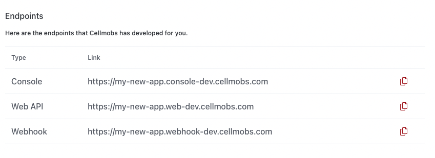
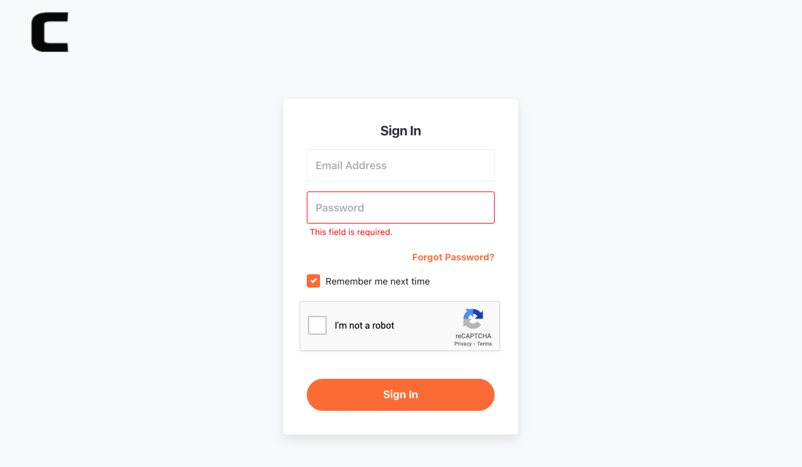

# App Console Login

Each Cellmobs App is configured and managed through the [Cellmobs App Console :fontawesome-solid-table-columns:](/app-console/getting-started), a powerful and user-friendly interface that provides you with all the tools necessary to manage every aspect of your application. 

The console, accessible via a dedicated url that is configured whenever you create a new Cellmobs App in the cellmobs.com website (e.g. **myapp.console.cellmobs.com** ). 

Each new app that you create in the [Your Apps](https://www.cellmobs.com/apps) section of the Cellmobs website, will provision a dedicated set of urls for you to access the console for this new app, to make API requests to the REST API from your client apps, and to receive Webhooks from API Integrations that you configure for your app. 

<figure markdown>
{width="100%" loading=lazy}
    <figcaption>Dedicated App Endpoints</figcaption>
</figure>

Cellmobs requires the implementation of reCAPTCHA and encourages Multi-Factor Authentication (MFA) to ensure that the platform and the applications built on it are secure and resilient against threats. By incorporating these security measures, we're looking to provide a robust and reliable environment for developers and users, ensuring the safety and integrity of the applications and data hosted on the platform.

For more details, please see [Authentication](/guide/authentication).

<figure markdown>
{width="100%" loading=lazy}
    <figcaption>App Console Login</figcaption>
</figure>

  