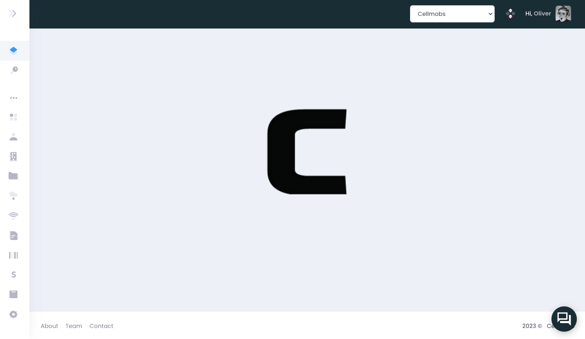

# Overview

The console, accessible via a dedicated url that is configured whenever you create a new Cellmobs App in the cellmobs.com website (e.g. **myapp.console.cellmobs.com** ). 

<figure markdown>
{width="100%" loading=lazy}
    <figcaption>Dedicated App Consoles</figcaption>
</figure>

The App Console, enables you to handle various elements of your app, such as:

### :fontawesome-regular-user:&nbsp;  [User Management](/app-console/manage-users) 
The console allows you to manage users, roles, and permissions, ensuring that each user has the appropriate level of access and functionality within your app.

### :fontawesome-solid-coins:&nbsp; [Subscription Plans](/app-console/manage-subscriptions)
You can create, modify, and manage subscriber plans, defining the pricing tiers, features, and benefits associated with your application to cater to different user preferences and needs.

### :fontawesome-solid-cart-shopping:&nbsp; [Product Catalogs](/app-console/manage-products) 
The console makes it easy to manage your app's product catalogs, allowing you to add, update, or remove products, categories, and other related information.

### :fontawesome-solid-images:&nbsp; [Content Management](/app-console/manage-content)
The console provides tools for managing content within your app, such as articles, blog posts, and multimedia assets, ensuring that your users have access to relevant and up-to-date information.

### :fontawesome-solid-globe:&nbsp; [Web Page Configuration](/app-console/manage-pages) 
The console enables you to configure the appearance, layout, and behavior of your app's web pages, tailoring the user interface to match your desired look and feel.

### :fontawesome-solid-chart-bar:&nbsp; [Monitoring and Analytics](/app-console/manage-users)
You can monitor your app's activity, resource usage, and performance, helping you identify areas for optimization and improvement.

### :fontawesome-solid-credit-card:&nbsp; [Billing and Payments](/app-console/manage-orders)
The console offers tools to manage all billing-related issues, including invoice generation, payment processing, and subscription management.

### :material-api:&nbsp; [API Integrations](/app-console/manage-integrations) 
The console provides tools for configuring API integrations with popular cloud apps and services. By connecting your app to third-party platforms, you can extend its functionality, streamline workflows, and improve the overall user experience.

### :material-email:&nbsp; [Templates](/app-console/manage-templates)
The console enables you to design and configure message templates for various communication channels, such as email, SMS, and system messages. This feature allows you to create consistent and personalized messages that align with your brand identity and tone.

### :material-table:&nbsp; [Data Models & Taxonomy](/app-console/manage-taxonomy)
The console allows you to customize and design your data model, defining the structure and relationships between different entities in your application. By tailoring your data model, you can ensure that it accurately represents your business requirements and supports the desired functionality.

### :material-view-list:&nbsp; [Vocabularies](/app-console/manage-vocabularies) 
Learn how to configure and manage Vocabularies to customize and adapt your app to specific use cases and requirements.

### :material-graph:&nbsp; [Workflow Automation](/app-console/manage-workflow)
The console provides tools for automating various tasks and processes within your application, such as data validation, notifications, and report generation. By automating repetitive tasks, you can improve efficiency and reduce the likelihood of errors.

**And much more....** 

By using the Cellmobs App Console, you can efficiently configure and manage all aspects of your application, ensuring a seamless and user-friendly experience. 

The console provides a centralized location for managing your app's resources, settings, and content, simplifying the app management process and allowing you to focus on delivering a top-notch experience for your users.

  