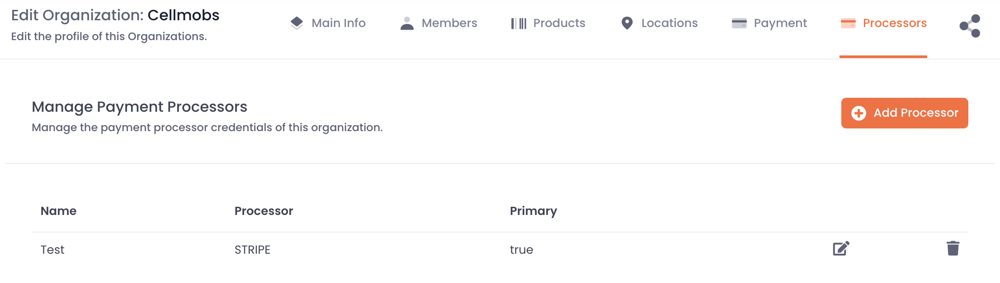
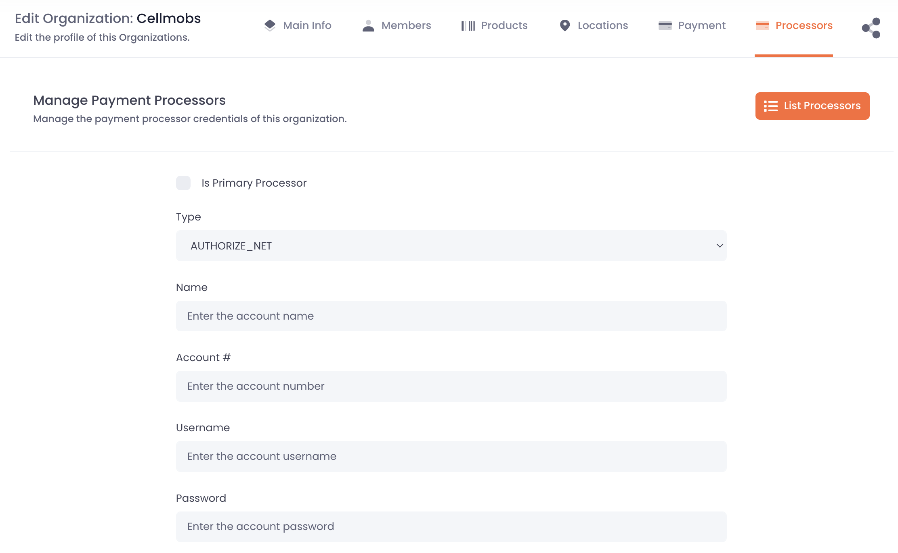

# Orders

An Order is a crucial Cellmobs entity that plays a central role in facilitating transactions and commerce across the platform. It serves as a key component that connects various elements of the commerce process, including Shopping Carts, [Subscription Plans](/app-console/manage-subscriptions), [payment transactions](#payment-transactions), and [payment processors](#payment-processors).

Orders are generated from Shopping Carts and Subscription Plans, representing the items or services that users wish to purchase. When an order is processed, it gets associated with one or more payment transactions (`PayTransaction`), which are then submitted to the payment processor linked to the Organization (`PaymentProcessor`). This ensures that the payment is securely handled and processed according to the platform's standards.

Cellmobs supports various payment processors, including [Stripe](https://stripe.com/docs){:target=_blank}, [Authorize.net](https://www.authorize.net/){:target=_blank}, [FirstData](https://globalgatewaye4.firstdata.com/){:target=_blank}, and [PayPal](https://developer.paypal.com/home){:target=_blank}. This allows organizations to choose their preferred payment processor and cater to the needs of their customers accordingly.

In addition to traditional payment methods, Cellmobs also supports virtual currencies, offering an alternative means of payment. Virtual currencies can be used as an abstraction for Fiat currencies, providing additional flexibility in payment options and catering to the growing demand for alternative payment methods.

## Viewing &amp; Managing Orders

## Shopping Carts

### Submitting Carts
 
### Editing Carts

## Subscription Plans

Cellmobs has a highly flexible and comprehensive subscription management system which allows for the creation of a diverse range of plans and packages to suit any use case. 

Here's how it works:

- **Trials and Free Tiers:** Cellmobs' subscription model supports trial periods and free tiers. This means you can offer your customers the opportunity to try out your services at no cost before they commit to a subscription. This is a popular strategy used by businesses to attract new customers and give them confidence in their services.

- **Plans and Products:** Each subscription plan in Cellmobs is associated with one or more [Products](/app-console/manage-products). These Products define the [pricing models](/app-console/manage-products/#pricing) that are then aggregated by the subscription plan. This allows for maximum flexibility as you can create a diverse range of Products each with its own price point, and then combine them into various subscription plans as needed. 

- **Flexible Pricing Models:** Cellmobs supports a variety of [pricing models](/app-console/manage-products/#pricing), including flat rate, tiered, volume, and per unit pricing, among others. This allows you to price your products and services in the way that makes the most sense for your business and your customers.

- **Complex Aggregations:** The platform is designed to handle complex subscription plans which aggregate a whole list of products and services, each with its own price point and usage tier. This means you can offer comprehensive packages to your customers that bundle together a wide range of services, while still maintaining detailed control over the pricing and usage allowances of each individual product or service within the package.

By allowing you to create such flexible and detailed subscription plans, Cellmobs helps you to cater to the varied needs of your customers, while also giving you the tools to manage and control your pricing strategy effectively. This helps to ensure that your subscription services are profitable and sustainable, while also providing excellent value to your customers.

## Subscribers

The Cellmobs platform comes with an intuitive management console that simplifies subscription management. Here's how you can utilize these features:

- **Subscriber Management:** The console provides a detailed view of all your subscribers. You can manually add new subscribers, modify existing subscription plans, view transaction histories, and much more. Each subscriber profile contains vital information such as subscription status, payment history, contact details, and their associated subscription plans, which can be modified as needed.

- **Billing and Payments:** Cellmobs automates the billing cycle based on the frequency you choose, such as weekly, monthly, or annually. Each subscriber is automatically billed based on this cycle and their subscription start date, eliminating the need for manual invoicing. The platform also supports multiple payment gateways, providing a seamless payment experience for your customers.

- **Refund Management:** In the event of payment disputes or cancellations, the Cellmobs console allows you to issue refunds quickly and efficiently. Refunds can be full or partial, depending on your policies, and are automatically recorded in the subscriber's transaction history for transparency.

- **Handling Past Due Accounts:** Cellmobs comes equipped with features to handle past due accounts. If a subscriber fails to make payment, the system can send automated reminders, pause services, or even cancel the subscription based on your set parameters. This way, you can manage delinquent accounts and minimize revenue loss.

- **Reporting and Analytics:** The console also provides in-depth reports and analytics about your subscriptions. This includes metrics like churn rate, average revenue per user (ARPU), lifetime value (LTV), and many more. These insights can help you make informed decisions about your subscription pricing, marketing strategies, and overall business model.

With Cellmobs, managing subscriptions becomes a streamlined and hassle-free process, allowing you to focus on delivering quality service to your customers.

## Payment Processors

Cellmobs has built-in support for multiple payment processors (aka payment gateways), providing a flexible and versatile approach to handle transactions within your application. 

In a single-vendor application, you might configure a primary payment processor for your application and then add additional ones as backups. This is useful because it can provide a fallback option if there are issues with the primary processor, ensuring that your application can continue to accept payments without interruption.

<figure markdown>
{loading=lazy}
    <figcaption>Organization Payment Processors</figcaption>
</figure>

However, in a multi-vendor or marketplace environment, Cellmobs provides a different approach. In such a scenario, you can allow individual sellers or vendors (represented by Organizations within Cellmobs) to configure their own payment processors. This means each vendor in your marketplace can choose the payment processor that best suits their needs or preferences.

<figure markdown>
{loading=lazy}
    <figcaption>Edit Payment Processors Credentials</figcaption>
</figure>

In either case, the payment processor associated with the selling Organization is used when an order is being processed. This ensures that the money from the sale goes to the correct party.

By supporting multiple payment processors and allowing for flexible configuration, Cellmobs ensures that your application can effectively and efficiently handle transactions, providing a smooth and frictionless experience for both sellers and buyers.

### Payment Transactions

  