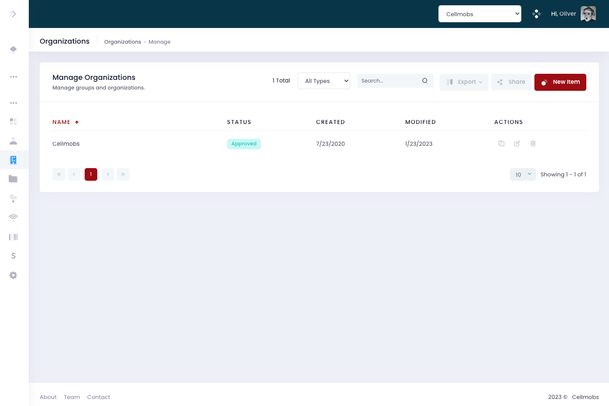
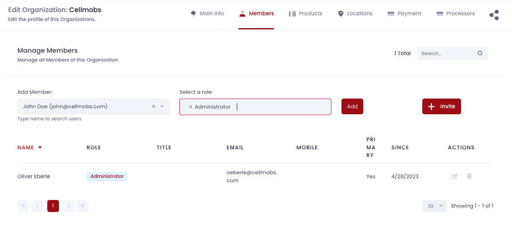
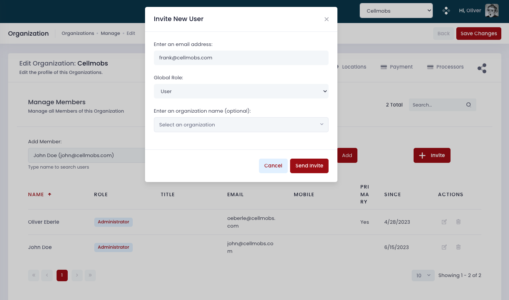
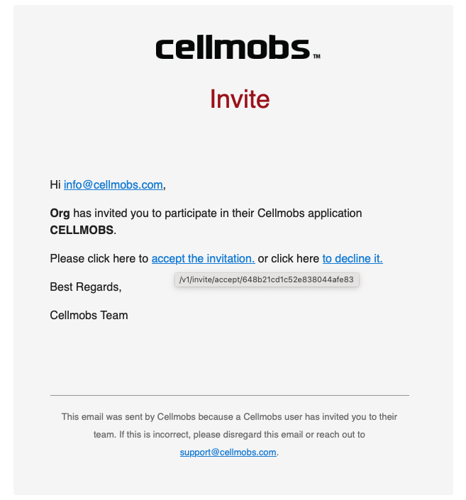
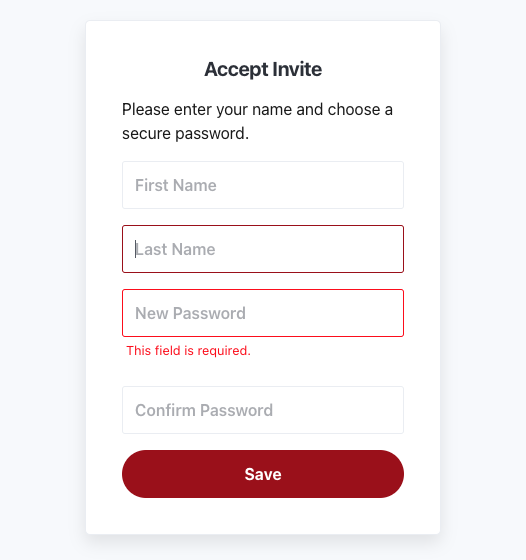
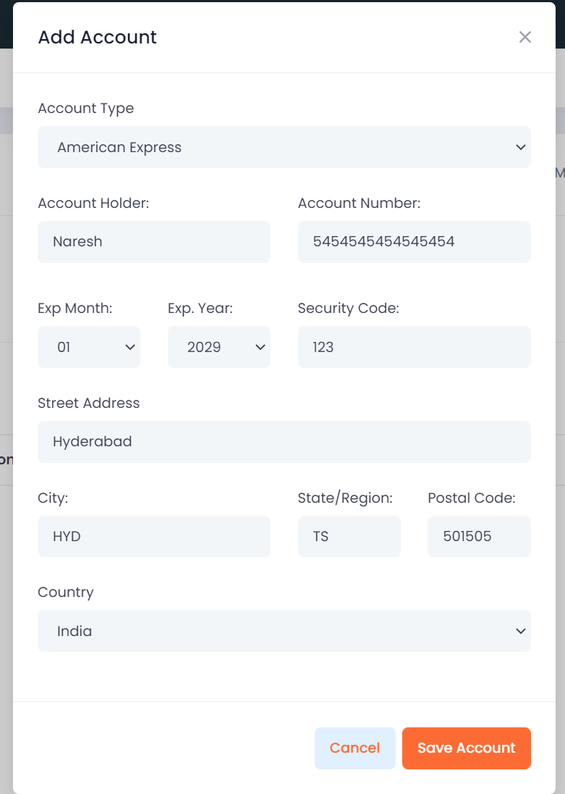
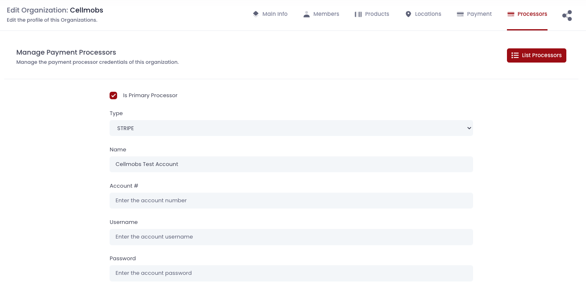

---
template: overrides/main.html
title: Organizations
---

# Organizations

In Cellmobs, the `Organization` entity serves as the central and most crucial component of the platform, as it connects and regulates access to almost every other entity. An Organization is responsible for defining the structure and access levels of various data points, ensuring proper management and control over the application.

Some of the key relationships and properties of an Organization include:

- **Members**: Members are the users associated with an Organization. They can have different roles and permissions, which determine their level of access and functionality within the organization.
- **Products**: Products are goods or services offered by the Organization. They can be physical items, digital content, or services provided by the organization to its customers.
- **Subscribers**: Subscribers are users who have opted in to receive updates and communications from the Organization, typically via email, SMS, or other messaging platforms.
- **Locations**: Locations represent physical or virtual addresses associated with the Organization, such as offices, stores, warehouses, or online presence.
- **Accounts**: Locations represent physical or virtual addresses associated with the Organization, such as offices, stores, warehouses, or online presence.
- **Payment Processors**: Locations represent physical or virtual addresses associated with the Organization, such as offices, stores, warehouses, or online presence.
- **Custom Roles**: Transactions are records of financial activities within the Organization, including payments, refunds, and other monetary exchanges.
- **Custom Fields**: Content encompasses all file-based data associated with the Organization, such as images, documents, videos, and more.

To configure and manage an Organization, developers and administrators can use the App Console (or the APIs).

___
## Manage Organizations

<figure markdown>
{loading=lazy}
    <figcaption>Manage Organzations</figcaption>
</figure>

## Managing Members

The Organization Members tab in the Organization editor is an essential tool for managing your team within the Cellmobs platform. It provides capabilities to both add and remove members to an Organization, while also offering control over the specifics of each member's role and other relational properties.

### Add / Remove Members

Existing members in the database can be added directly to the Organization. If you need to modify the role of any member or tweak other properties pertaining to their relationship with the Organization, the editor allows for those adjustments. This provides the ability to fine-tune the access levels and responsibilities of each member within the Organization.

<figure markdown>
{loading=lazy}
    <figcaption>Add / Remove Members</figcaption>
</figure>

### Invite Members

The platform also facilitates an invitation system for new members. 

<figure markdown>
{loading=lazy}
    <figcaption>Invite Members</figcaption>
</figure>

By sending an invite to the prospective member's email, you can extend an opportunity for them to join your Organization. 

<figure markdown>
{loading=lazy}
    <figcaption>Email Invite</figcaption>
</figure>

Upon receiving this invite, the individual has the option to accept or decline. If they opt to accept, they'll be prompted to create a password for their new account.

<figure markdown>
{loading=lazy}
    <figcaption>Accept Invite</figcaption>
</figure>

Following the successful completion of this acceptance process, confirmation emails are automatically dispatched to the Organization's Administrators. These notifications inform them that the invited individual has accepted their invitation, allowing them to update the team roster accordingly.

This streamlined process makes it straightforward to manage your team's composition, access levels, and roles, enabling your Organization to operate efficiently on the Cellmobs platform.
 
 

!!! tip
    Invitations within Cellmobs are particularly useful when building community-oriented applications. These applications often revolve around the idea of users creating their own groups or communities to collaborate, engage, or partake in specific activities. 

    By inviting new members to join their specific group within the broader application, users can curate a network of individuals aligned with their interests or goals. This allows for a degree of personalization and user ownership within the application, which can significantly enhance user engagement and satisfaction.

    Whether these groups are organized around collaborative projects, shared interests, group learning, or social interaction, the invitation system of Cellmobs empowers your users to grow and manage their own communities within your application's ecosystem. This is a powerful feature that can facilitate a diverse range of user interactions and activities, contributing to the dynamic and engaging nature of your Cellmobs app.

 

## Manage Locations

Cellmobs brings geo-location capabilities right at the core of its platform, allowing the creation of location-aware applications with ease. The importance of geo-location in today's digital landscape is immense. Whether it's to enable location-based searches, personalized user experiences, or targeted marketing efforts, having access to reliable and intuitive geo-location functionality can greatly enhance the user experience and utility of an application.

Most entities within Cellmobs can be associated with one or more locations, each possessing its unique latitude and longitude coordinates. For instance, if an entity is an Organization, these locations could represent physical store branches, event venues, or any geographic point of relevance. The latitude and longitude coordinates associated with these locations allow for precise and accurate location tracking and identification. 

<figure markdown>
![Admin Organizations 7][Admin Organizations 7]
</figure>

Furthermore, the [Cellmobs API](https://api.cellmobs.com) supports specific location-based search queries. Users can perform searches based on latitude, longitude, radius, or boundary boxes, enabling them to find entities within a certain geographic area. For example, if a user wants to find all events of a particular user group happening within a certain radius of their current location, this can easily be accomplished with Cellmobs' geo-location features.

This granular control and deep integration of geo-location information throughout the platform make Cellmobs a powerful tool for developing location-aware applications. From hyper-local content delivery to detailed spatial analysis, Cellmobs provides developers the tools to leverage geo-location in a myriad of ways, resulting in applications that are more engaging, personalized, and relevant to the end-user.

## Managing Financial Transactions

In the digital economy, having streamlined and efficient financial management capabilities are crucial for businesses. Cellmobs allows each user and Organization on the platform to have accounts, which could be bank accounts, credit accounts, or even virtual currency accounts.

The purpose of these accounts is to facilitate smooth and hassle-free transactions between organizations. This is particularly useful in a marketplace scenario where there are multiple buyers and sellers, each possibly having different preferred methods of transaction.

### Accounts

An organization's account serves as its financial hub within the Cellmobs ecosystem, accommodating the inflow and outflow of funds, much like a traditional bank account. Whether you are receiving funds from a sale or making payments to a vendor, these transactions are facilitated through your organization's account on Cellmobs.

But what makes Cellmobs stand out is the ability for each organization to configure its own payment gateway. In an online marketplace setting, this feature is particularly powerful. Imagine you're a vendor selling goods or services on a marketplace powered by Cellmobs. Instead of the marketplace operator handling all transactions, and then disbursing funds to you, the payment gateway feature allows your customers to pay you directly. This direct payment structure can dramatically speed up the receipt of funds and gives you, as a vendor, greater control over your finances.

<figure markdown>
{ width="60%" }
</figure>

### Payment Gateways

Setting up a payment gateway is a straightforward process and we support integration with many popular providers (FirstData, Stripe, PayPal, Authorize.net). Once your gateway is configured, it can handle transactions from multiple sources - credit/debit cards, digital wallets, bank transfers, and more - providing flexibility for your customers and smooth operation for your business.

<figure markdown>
{loading=lazy}
    <figcaption>Configure Payment Gateway</figcaption>
</figure>

By providing organizations with the ability to have accounts and configure payment gateways, Cellmobs empowers businesses to manage their financial operations efficiently, securely, and with greater control. It's yet another way we're striving to make digital commerce smoother and more accessible for everyone. 

## Add Custom Roles

## Add Custom Fields

- Click on Add Organization 
- Upload the logo of the company 
- Enter the name of the column 
- Select the provider as “CELLMOBS”  
- Select the parent organization name (if any), if not, you can leave it blank 
- Enter code (if any) 
- Enter Legal name of the organization 
- Select the Type as “Customer” 
- Select the appropriate Status of the organization 
- Enter the Phone # of the organization 
- Enter the Primary Email of the organization 
- Provide the website URL of the organization 
- Provide some text as a summary of the organization 
- Provide few details as Description of the organization

  

[Admin Organizations 2]: ../assets/screenshots/admin/admin-organization-2.png
[Admin Organizations 7]: ../assets/screenshots/admin/admin-organization-7.png
[Admin Organizations 8]: ../assets/screenshots/admin/admin-organization-8.png

