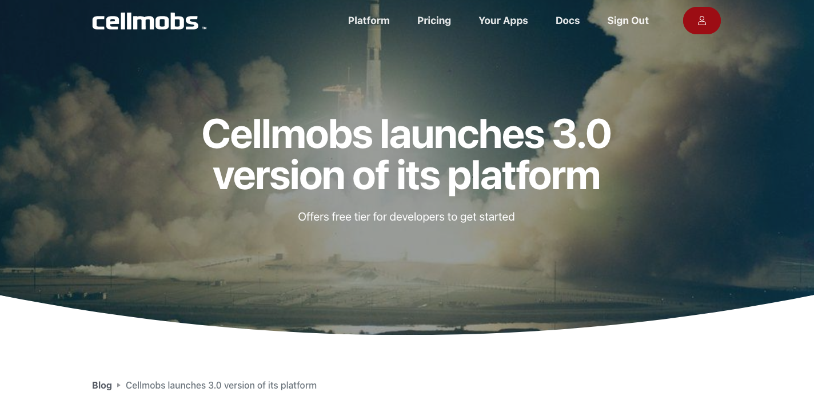
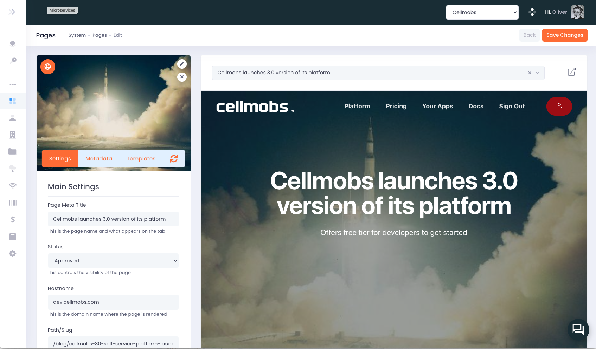
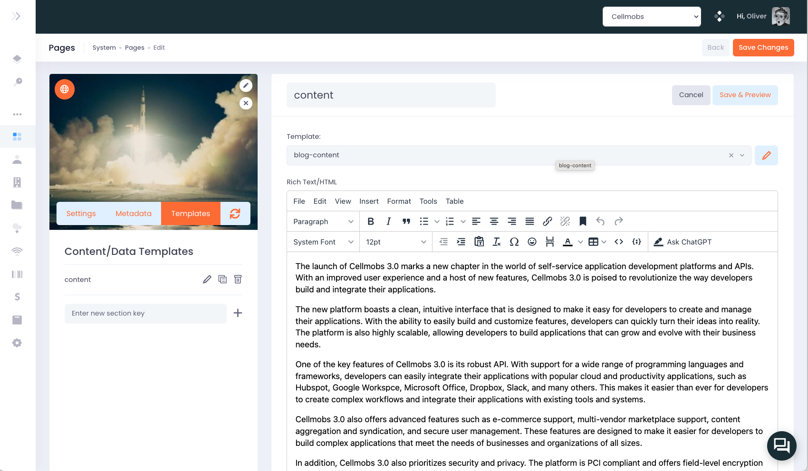
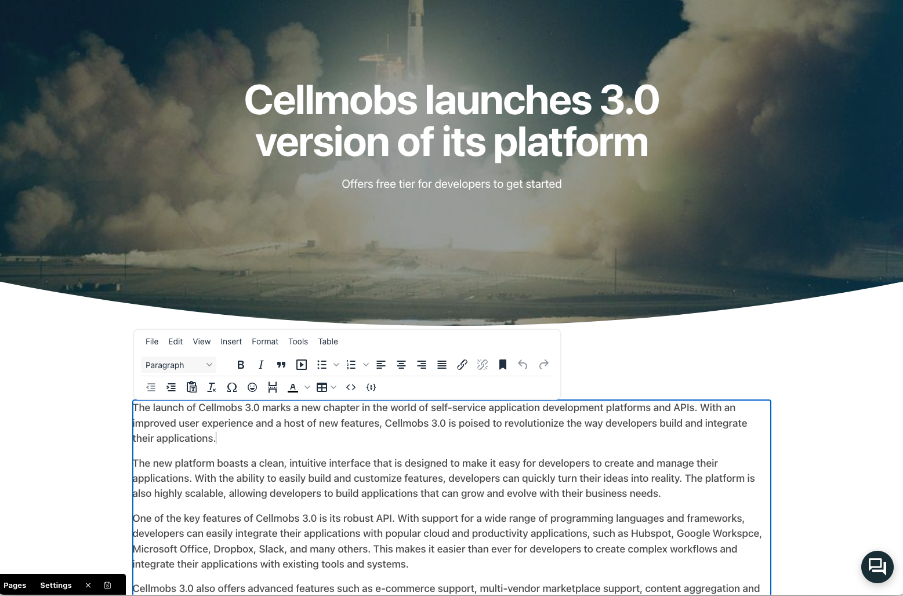
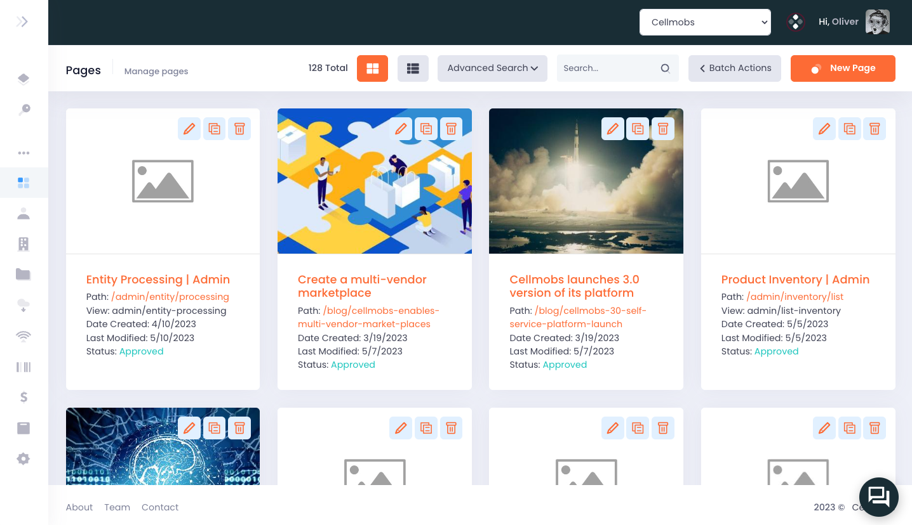

# Pages

Pages are the primary entity for configuring and managing web page templates, metadata, and content. They are encapsulated within the Cellmobs `WebPage` entity, which serves as the foundation for creating and organizing the structure of a web application.

WebPage entities allow developers to define the layout, design, and components of a web page, ensuring consistency and ease of management across the entire application. By using a WebPage entity, developers can create various types of pages, such as landing pages, blog posts, product pages, and more, all while maintaining a uniform look and feel.

Metadata associated with WebPage entities plays a crucial role in search engine optimization ([SEO](/guide/seo)) and accessibility. Developers can specify metadata such as title, url, description, keywords, and other relevant information to optimize their pages for search engines.

Content within a WebPage entity is flexible and can include text, images, videos, and other multimedia elements, enabling developers to create rich and engaging web pages that cater to their specific needs and target audience. WebPage content can be static or dynamic and fetched from the database and dynamically rendered through page [template](/app-console/manage-templates) fragments. 


**High-level structure of a WebPage**

```
WebPage
|--Organization
|--Content (PrimaryContent)
|--Sections
    |--Key
        |--PageSection
            |--WebTemplate
            |--Html
            |--Data
|--Settings
|--Metadata

```

## Primary Content

Primary [Content](/app-console/manage-content) is typically an image or video. It is used as open graph url and as such represents a page to other services if a user shares the page url on social media. The primary content is also often used as hero image of a page. 

<figure markdown>
{loading=lazy}
    <figcaption>Facebook Share</figcaption>
</figure>

<figure markdown>
{loading=lazy}
    <figcaption>Hero Image</figcaption>
</figure>


## Page Editor

The Cellmobs App Console's page editor is a comprehensive tool for managing and optimizing your web pages. Here's how it works:

<figure markdown>
{loading=lazy}
    <figcaption>Page Editor</figcaption>
</figure>

- **Main Settings**: The main settings allow you to control the primary aspects of your web pages, such as the page URL, the page title, and the status of the page (published, draft, etc). It is also where you would set up any [A/B testing](#ab-testing) variants for the page.

- **Meta Tags**: In the [meta tags](https://www.w3schools.com/tags/tag_meta.asp){:target=_blank} section, you can manage the metadata for your page. This includes things like meta descriptions, keywords, and [Open Graph](https://ogp.me/){:target=_blank} tags, which can be crucial for search engine optimization and social media sharing.

- **Page Content**: The page content section provides a rich editor for managing the actual content of your page. This can include text, images, videos, and any other content you want to include on your page. The editor supports rich text formatting and allows you to arrange your content in a variety of ways.

<figure markdown>
{loading=lazy}
    <figcaption>Edit Page Content</figcaption>
</figure>

- **Underlying Templates**: With the template editor, you can modify the underlying HTML and CSS of your page. This can be useful for implementing custom designs or functionalities that go beyond what's possible with the content editor alone. 

- **Inline Editing**: When used in conjunction with the Cellmobs [React SDK](/setup/react-sdk), the App Console page editor can also support inline editing of page content. This means you can make changes to your page directly in the context of the live website, seeing exactly how your changes will look to end users in real time.

<figure markdown>
{loading=lazy}
    <figcaption>Optional Inline Editor</figcaption>
</figure>


## Dynamic Content

The Cellmobs page editor offers support for dynamic content, allowing for a highly customizable and adaptive user experience. It achieves this by allowing you to define complex dynamic search filters for entities such as WebPage, [Product](/app-console/manage-products), and [Content](/app-console/manage-content).

When a user loads a page, these filters are automatically executed against the current state of your data. The results of these queries then populate the relevant sections of your page. This dynamic content is accessed through the `data` field of the dynamic PageSection entity in your page structure.

For example, you could set up a filter on a Product page to display related products based on the product currently being viewed. When a user visits that page, the filter would execute a search for other products with matching attributes (e.g., same category, same brand, etc.). The results would then be dynamically inserted into the designated section of your page.

Or, you could have a dynamic section on your homepage that displays the most recent blog posts. When the page loads, it would execute a search for Content entities with a type of 'blog post', sorted by creation date, and display the results on the page.

<figure markdown>
{loading=lazy}
    <figcaption>Dynamic Blog Posts Page Section</figcaption>
</figure>


Dynamic content enables you to create more engaging, personalized, and up-to-date experiences for your users, without having to manually update the content yourself. It's a powerful way to keep your app fresh and relevant, and to drive engagement with your content.

## Page Sections


## A/B Testing

A/B testing is a powerful tool for improving the user experience and effectiveness of your web pages, and Cellmobs provides built-in support for this. 

<figure markdown>
{loading=lazy}
    <figcaption>Dynamic Blog Posts Page Section</figcaption>
</figure>

Here's how it works:

1. **Page Variations**: In Cellmobs, you can create multiple variations of the same page, each with the same URL but differing content, layout, images, or any other element you want to test.
2. **Random Selection**: When a user navigates to the URL in question, Cellmobs selects one of the page variations based on their configured viewto display to the user. The selection process is distributed based on the configured view share for each page  (e.g. Page A 10%, Page B 90%), ensuring that each gets a desired amount of exposure.
3. **Multiple Variations**: Unlike many platforms that limit A/B testing to just two variations (A and B), Cellmobs allows for an unlimited number of page variations. This means you can test multiple hypotheses concurrently.
4. **Analysis**: With the appropriate analytics setup, you can measure the impact of each variation on user behavior and outcomes. This could be engagement metrics like time spent on page, conversion metrics like form submissions or sales, or any other key performance indicator relevant to your goals.
5. **Optimization**: After collecting and analyzing your data, you can determine which page variation is the most effective and make it the default version, or continue testing and refining further.

By facilitating A/B testing, Cellmobs enables you to continuously improve your web pages based on real user data, maximizing the effectiveness of your digital experiences.
  
___
## Managing Pages

As an organizational administrator, specifically a `SYSADMIN`, you have complete control over managing your application's pages. This includes the power to enable or disable any page in the application, essentially controlling what is visible and accessible to your users.

Moreover, if you are a `SYSADMIN`, you have the ability to edit the configuration of your App Console pages. However, this power comes with great responsibility as any misconfiguration could potentially impact the functionality of your app console. Therefore, it's advisable to exercise caution when making changes at this level.

In order to distribute responsibility and control, Cellmobs recommends associating different organizations with your custom pages. By doing this, you can delegate specific roles within those organizations to edit and manage your page content. This approach not only ensures a more secure and controlled setup but also enables more efficient management and curation of your page content. 

For instance, you could delegate content creation and updates to your marketing team for certain pages, while your product team could manage product-related pages. This way, you can ensure that the right people have the appropriate level of access, improving both security and productivity.

<figure markdown>
{loading=lazy}
    <figcaption>Manage Pages</figcaption>
</figure>

## Create a new Page

[WALKTHROUGH]

<br><br>