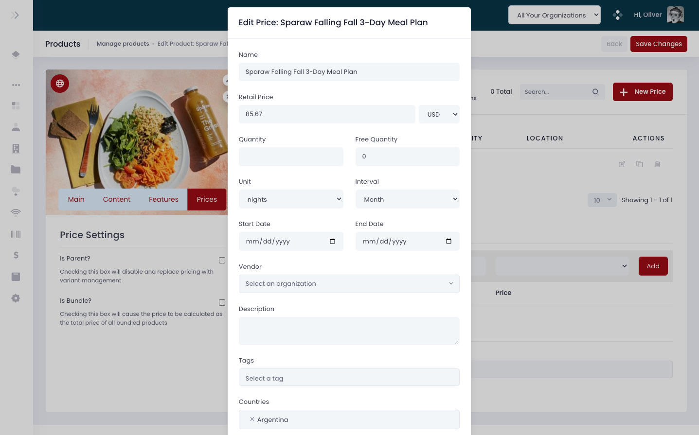
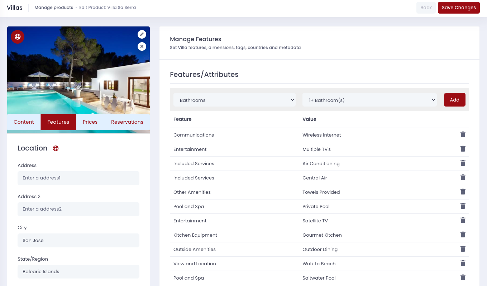
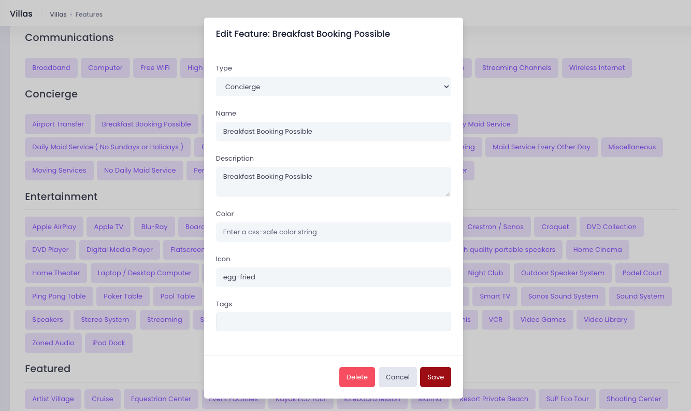
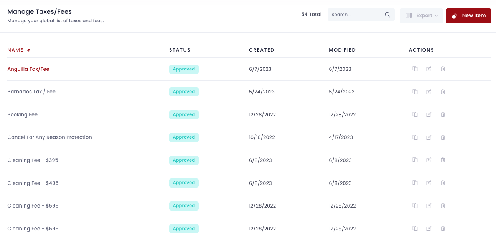
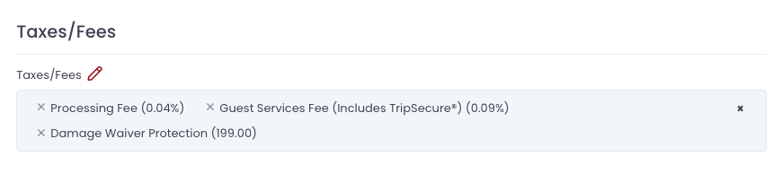
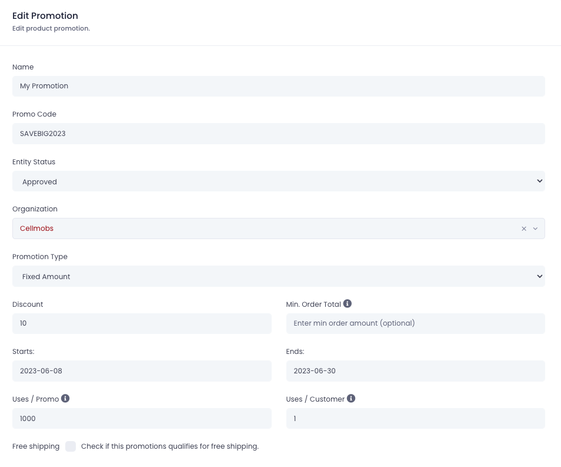
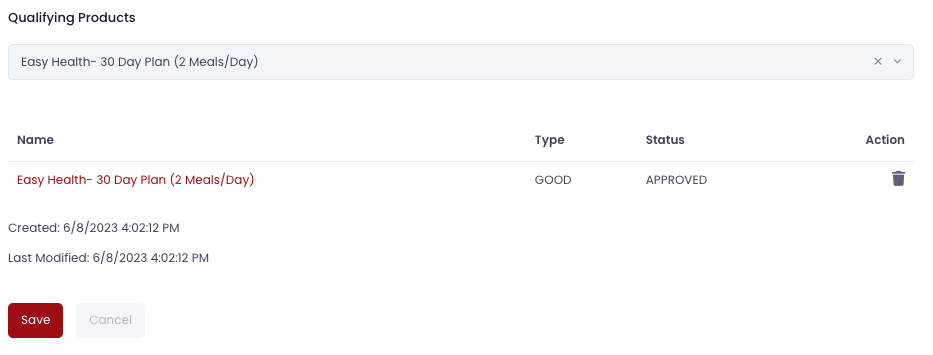

# Products

Products in Cellmobs can be categorized as either `GOODS` or `SERVICES` and represent items or offerings that users pay for. These Products are associated with Organizations that sell goods and services through a Cellmobs app, catering to various business models, such as traditional online stores or services that are part of [subscription plans](/app-console/manage-subscriptions).

The App Console provides a user-friendly interface for designing and managing your product catalog, allowing you to create and organize Products in a way that best suits your application's needs. With this tool, you can easily manage and customize your offerings while maintaining a structured and efficient product catalog.

To facilitate seamless integration of commerce functionality into your client application, the Cellmobs platform offers the [Commerce API](https://api.cellmobs.com/#65028275-5c8f-4290-b207-4bfba42c0aee){:target=_blank}. This comprehensive API provides all the necessary methods to create, update, and retrieve Products, manage inventory, handle orders, and more. By leveraging the Commerce API, you can efficiently build and maintain a robust commerce solution within your application, ensuring a smooth and feature-rich experience for your users.

!!! info
    Integrations to sync your data with Amazon, Shopify and Quickbooks are in development and will be available later this year. 

___
## Creating Products

<!-- - Go to [Products Section](https://console.cellmobs.com/admin/products/list)
- Go to the Products section 
- Click on New Product 
- Enter the name of the “Product”  
- Select the Type (Good, Service, Subscription, Bundle, Credit, Gift) 
- Select the Status 
- Provide the “Seller/Organization” name 
- Provide the Brand/Provider name 
- Enter the quantity of the products 
- Provide the product specifications like width, height, length, (as applicable) 
- Provide the description of the product 
- Go to the Price section and enter the pricing details of the product 
- Go to Products section and upload the products/image of your product 
- Go to references and manage the references by required details 
- After providing all the required details, click on save for the product getting created
   
    <figure markdown>
[![Admin Products 1]][Admin Products 1]
    </figure>
    <figure markdown>
[![Admin Products 2]][Admin Products 2]
    </figure>
    <figure markdown>
[![Admin Products 3]][Admin Products 3]
    </figure>

[Admin Products 1]: ../assets/screenshots/admin/admin-products-1.png
[Admin Products 2]: ../assets/screenshots/admin/admin-products-2.png
[Admin Products 3]: ../assets/screenshots/admin/admin-products-3.png -->

**1. Navigate to /admin/products/list**

**2. Click "New Product"**

**3. Click the "Enter product name" field.**

**4. Click "Select a type" to choose a Product Type**

**5. Click "Service" if you want to create a "service" or choose a different type (required). Edit the Entity Status if you like. **

**6. Click "Select an organization" and look for the organization that will sell this product**

**7. Type to find and select a seller Organization  (required)**

**8. Click "Save Changes" to establish your new Product in the Catalog**

 

## Adding Content

Products are versatile entities that can be linked with one or more Content entities to effectively showcase or deliver them. The [Content](/app-console/manage-content) entities associated with a Product can take on different roles depending on the nature of the Product itself.

For instance, if the Product being sold is a physical item, such as clothing or a gadget, the linked Content entities typically serve as product images. These images help potential buyers understand the Product's appearance, features, and functionalities better, thus aiding in their purchase decision.

On the other hand, when the Product is a digital item, such as a movie, music album, ebook, or software, the associated Content entities could be the actual digital files that the user purchases. Once the transaction is complete, these digital files can be made accessible to the buyer for download or streaming, depending on the nature of the digital product.

This association between Products and Content entities in Cellmobs provides a highly flexible structure that caters to a broad spectrum of product types, both physical and digital. The result is a platform that can accommodate a wide range of ecommerce business models and product offerings.

## Pricing

Pricing your products on Cellmobs is not only simple but highly adaptable to suit a variety of business models and strategies. This flexibility ensures that you can set up pricing rules that perfectly match your business needs and the purchasing habits of your customers. Here's how:

- **Region-specific pricing**: Cellmobs allows you to set different prices for different regions. This can be beneficial if you're selling your product globally and want to adjust prices based on regional economic factors or competitive landscape.

- **Seasonal pricing**: Depending on your product or service, you might want to change your pricing based on the season. For instance, holiday discounts or higher rates during peak season can easily be implemented.

- **SKU variations pricing**: If you have variations of a product (e.g., different colors, sizes, or specifications), each SKU can be priced differently. This feature is particularly useful for inventory with different cost structures.

- **Interval pricing**: You can set prices to vary based on the time frame for a subscription service. For example, customers may be charged a different rate if they subscribe monthly versus annually. This allows for flexibility in pricing structures that can incentivize longer-term commitments from customers.

<figure markdown>
{loading=lazy}
    <figcaption>Product Pricing</figcaption>
</figure>

## Features

Product features provide a versatile way to highlight the attributes or capabilities of your products. By using the Feature Editor, you can create and manage these features effortlessly and then apply them to one or more products as needed.

<figure markdown>
{loading=lazy}
    <figcaption>Product Features</figcaption>
</figure>

Features can be anything you deem important for your customers to know about a product. It might include physical characteristics (like size, weight, color), capabilities (like speed, power, compatibility), or any other aspect that differentiates your product. 

Here's how it works:

- **Using the Feature Editor**: The Feature Editor is an intuitive tool in the Cellmobs platform where you can create, modify, or remove product features. These can then be associated with your products to provide detailed information to your customers.

- **Grouping Features**: Grouping features allow you to categorize similar features under a common theme for better organization and easier navigation. For example, all features related to the physical attributes of a product can be grouped under a "Specifications" feature type.

- **Utilizing `FEATURE_TYPES`**: `FEATURE_TYPES` is a vocabulary in Cellmobs that allows you to define and manage different groups of features. You can edit this vocabulary using the Vocabulary Editor. By doing so, you can maintain consistency in how you classify features across your products.

- **Applying Features to Products**: Once your features are set up, you can apply them to any product you wish. This makes it easy to show customers the features of a product, enhancing the product descriptions and possibly influencing the buying decision.

By leveraging the flexibility and ease of the Feature Editor, you can significantly enhance the way you present your products, leading to a better-informed customer and potentially increased sales.

<figure markdown>
{loading=lazy}
    <figcaption>Feature Editor</figcaption>
</figure>

## Taxes &amp; Fees

Taxes and fees play a crucial role in eCommerce and digital platforms, impacting the final cost to the consumer. With Cellmobs, managing these financial elements is made straightforward using the Taxes and Fees Editor.

<figure markdown>
{loading=lazy}
    <figcaption>Taxes and Fees</figcaption>
</figure>

- **Configuring Types of Charges**: In Cellmobs, you can configure both fixed and percentage-based charges. Fixed charges are one-time fees, while percentage-based charges can be set to apply to the subtotal or total amount of the cart.

- **Setting Quantity-based Fees**: The platform allows you to impose fees based on the quantity of product units in the cart. This can be useful for handling bulk purchases or setting up discounts based on quantity.

- **Applying Charges at Different Stages**: You have the flexibility to apply charges at various stages of the checkout process. For instance, you can configure certain fees to apply before taxes (e.g., shipping or handling fees), while others, like processing fees, can be imposed after tax calculation.

- **Creating Tax Rules**: With the Tax Editor, you can set up tax rules based on various criteria such as location, product type, etc. This helps ensure that you're charging the correct tax amount based on local laws and regulations.

<figure markdown>
{loading=lazy}
    <figcaption>Product Taxes and Fees</figcaption>
</figure>

By offering this granular control over taxes and fees, Cellmobs allows you to accurately reflect the cost implications of transactions, giving your customers a clear breakdown of charges before they finalize their purchase. This can help foster transparency and trust between your business and its customers, enhancing the overall shopping experience.

## Promotions

Promotions are an effective way to drive customer engagement, boost sales, and manage inventory. Cellmobs provides robust support for a range of promotional activities. 

<figure markdown>
{loading=lazy}
    <figcaption>Promotions Editor</figcaption>
</figure>

- **Promotion Scope**: You have the flexibility to set promotions at a global store level or limit them to specific products or product categories. This is done by using [tags](/app-console/manage-tags/) to categorize products and then applying promotions to these tags.

<figure markdown>
{loading=lazy}
    <figcaption>Product Promotions</figcaption>
</figure>

- **Promotion Types**: Cellmobs allows you to create promotions that offer fixed dollar amounts off the regular price, or percentage-based discounts. This means you can set up promotions that take, for example, 20% off the total order, or provide a flat $10 off on certain products.

- **Promotion Duration**: Promotions can be set to be active for specific time frames. This is particularly useful for running seasonal sales, flash sales, or limited-time offers.

- **Promotion Usage**: You can limit the number of times a promotion can be used by an individual user or in total. This can be useful for exclusive offers or when the supply of a promoted item is limited.

- **Promotion Codes**: These can be used to allow customers to claim a discount at checkout. These codes can be distributed through various marketing channels to drive customer engagement.

!!! tip  
    Remember that promotions are a powerful tool for encouraging purchases, so use them strategically to ensure you're maximizing their potential while preserving your margins.

## Reservations

In many industries such as travel, health & fitness, and hospitality, the ability to make and manage reservations is key to their operation. Recognizing this, Cellmobs has built-in support for product reservations. This feature offers an effective way to manage the availability and booking of products and services, offering both businesses and customers a smooth transaction process.

- **Reservation Types**: Cellmobs supports a variety of reservation types, making it adaptable to a wide range of industries. Whether it's a vacation rental, a guided trip, or an appointment for a service, businesses can customize the booking process to suit their needs.

- **Availability Management**: With Cellmobs, you can manage the availability of your products. You can set specific times and dates when a product or service is available for reservation. This way, you can avoid overbooking or scheduling conflicts.

- **Booking Confirmation**: Once a customer makes a reservation, a confirmation is sent automatically. This confirmation includes all the necessary details about the reservation, providing a record for both the business and the customer.

- **Reservation Modifications and Cancellations**: Customers can modify or cancel their reservations, subject to the policies you set. This feature provides flexibility for customers, while also helping businesses manage their schedules and inventory.

- **Integrated with Order Management**: Reservations are fully integrated with the order management system on Cellmobs. This ensures that all transactions are properly tracked, and can facilitate tasks such as billing, inventory management, and customer service.

By incorporating reservations into the e-commerce experience, Cellmobs allows businesses to extend their offerings and provide more comprehensive and sophisticated services to their customers.

<!-- ## Inventory -->

  