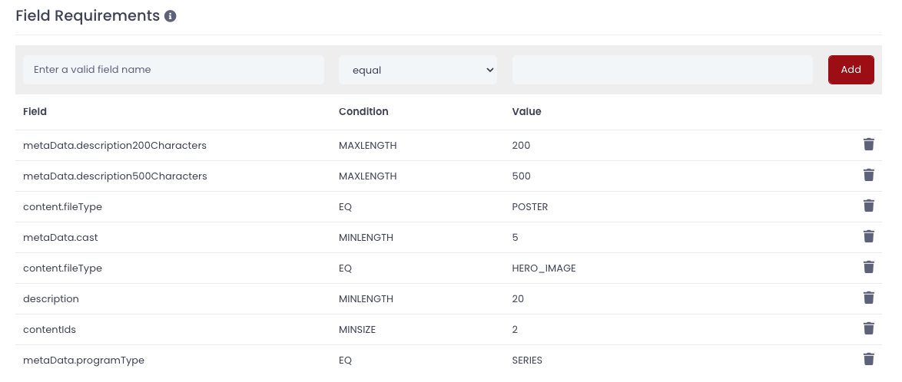

# Requirements

In Cellmobs, the Entity Requirements feature is a powerful tool that enhances data consistency and supports the creation of various workflows for your application. This feature can be configured for any type of entity in the system, including users, products, orders, and more.

<figure markdown>
{loading=lazy}
    <figcaption>Requirement Settings</figcaption>
</figure>

Entity Requirements are essentially rules or conditions that need to be satisfied by the data attributes of entities. These requirements can be applied broadly to all instances of an entity type or narrowed down to only target a specific subset of an entity that meets a certain filter condition.

<figure markdown>
{loading=lazy}
    <figcaption>Requirement Filters</figcaption>
</figure>

When an entity is saved or modified in the system, Cellmobs checks whether the entity matches any existing Entity Requirements. If matched, the system attempts to validate the entity against these requirements. If the validation is successful, it ensures the data consistency of your application by confirming that the entity data is accurate and adheres to the set requirements.

<figure markdown>
{loading=lazy}
    <figcaption>Requirement Rules</figcaption>
</figure>

However, if the validation fails, the platform does not merely return an error. Instead, it can trigger a transition in the entity's status and initiate different API processes. For instance, if the validation of an order entity fails, it might automatically trigger an API process that sends an email notification to the concerned party.

This ability to link Entity Requirements to API processes unlocks the potential to create a variety of automated workflows. These could include data integrity checks, notifications, data syncing, data transformation, and more. By effectively using Entity Requirements, developers can build a more efficient, reliable, and automated system within the Cellmobs platform.

Click here to learn how to [trigger API Processes](/app-console/manage-workflow) based on entity requirements.

  