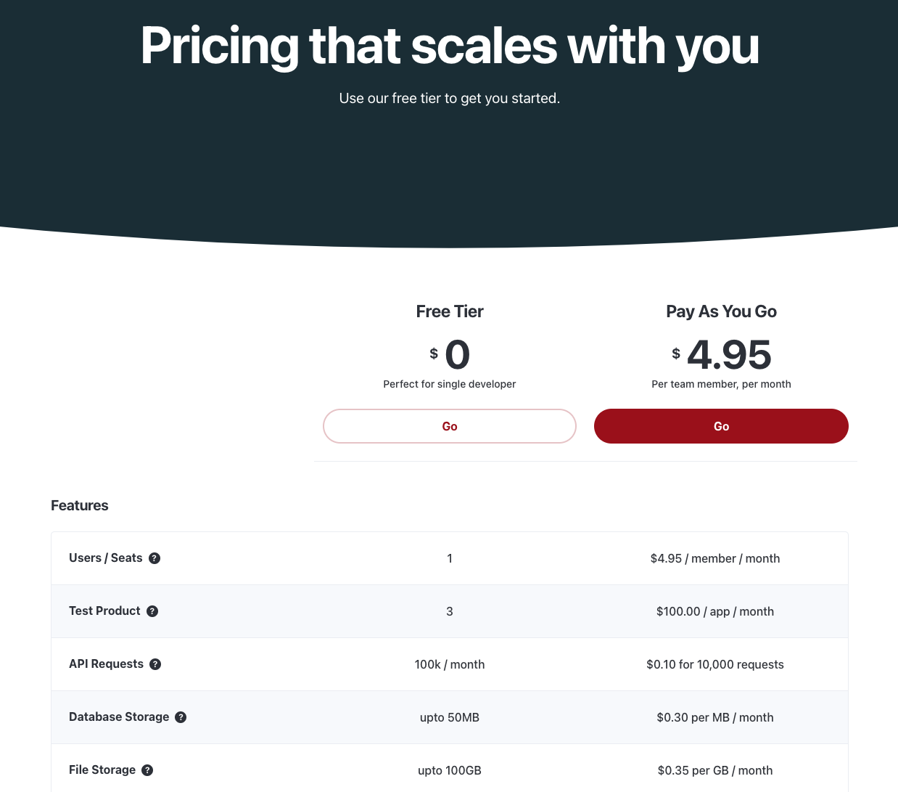

# Subscriptions

Subscriptions are a highly effective way to monetize your Cellmobs application by generating recurring revenue from users. By offering subscription plans, you can provide your users with access to premium features, content, or services on a regular basis, such as monthly or annually. This recurring revenue model can lead to more predictable cash flow and a better understanding of your customer base.

The advantages of using subscriptions include:

1. **Predictable Revenue**: With subscription plans, you can more accurately forecast your revenue over time, making it easier to plan and allocate resources.
2. **Customer Retention**: Subscriptions encourage customer loyalty and long-term commitment, leading to higher retention rates and lifetime value.
3. **Flexible Pricing**: Subscription plans allow you to create different pricing tiers, catering to various user segments and their specific needs. This enables you to attract a wider audience and maximize revenue potential.
4. **Automated Billing**: Cellmobs handles the billing process for your subscription plans, automatically charging customers and managing renewals, freeing you up to focus on your core business.
5. **Improved User Experience**: Offering a subscription model can enhance the user experience by providing ongoing value, updates, and support, fostering a sense of trust and satisfaction among your users.

## Subscription Plans

Cellmobs provides the necessary tools and infrastructure to easily create and manage subscription plans for your application. 

<figure markdown>
{width="100%",loading=lazy}
    <figcaption>Sample Subscription Plan</figcaption>
</figure>

Create a subscription plan typically starts with defining the [Products](/app-console/manage-products) that make up your plan. Once you have your Products configured you can define the plan through the console.

### Creating a Plan

## Managing Subscribers

### Create Subscribers in the Console

### Create Subscriber with the API

### Editing Subscriptions

  