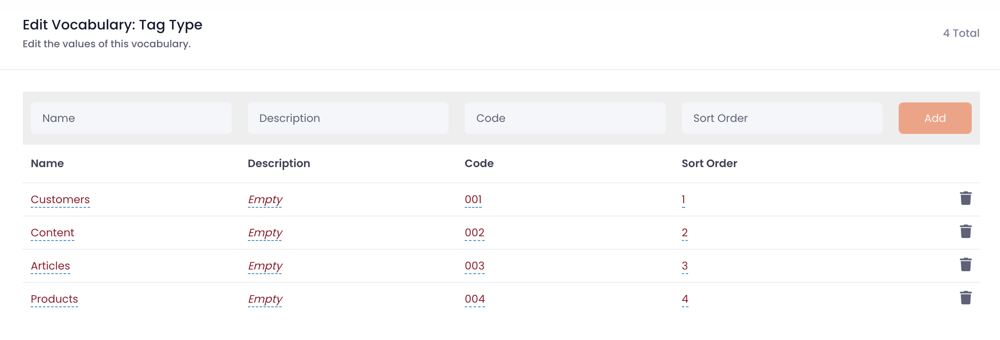
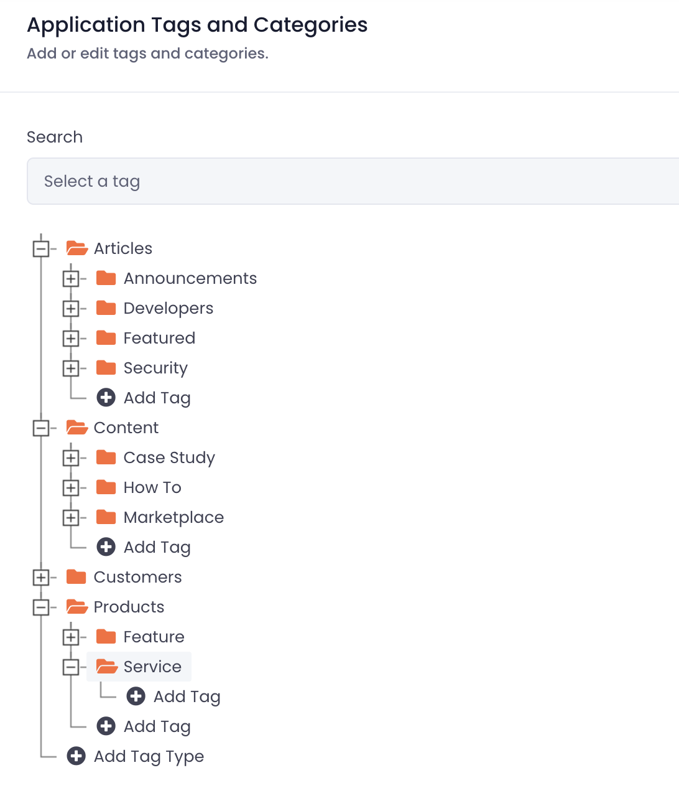
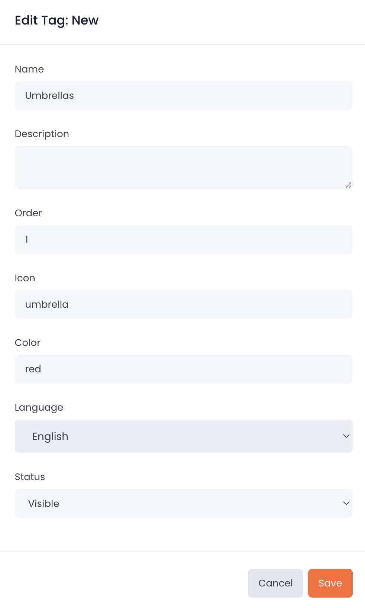

# Tags

Cellmobs Tags are a versatile and powerful feature that can be utilized in various ways to enhance the organization and functionality of your app. By leveraging Tags, you can create custom structures, categorize content, and establish relationships between different elements within your application. For more see [common use cases for Cellmobs Tags](/setup/setting-up-tags).

___
## Tag Types

Vocabulary `TAG_TYPE`

<figure markdown>
{loading=lazy}
    <figcaption>Configure Tag Types</figcaption>
</figure>

<figure markdown>
{width="80%" loading=lazy}
    <figcaption>Configure Tag Hierarchies</figcaption>
</figure>

<figure markdown>
{width="60%" loading=lazy}
    <figcaption>Add New Tag</figcaption>
</figure>

