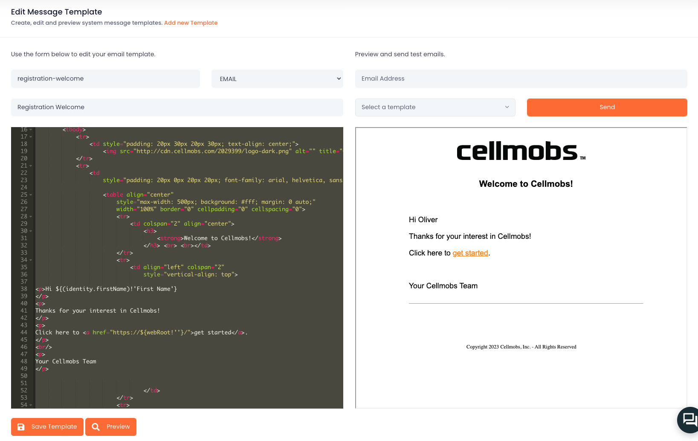

# Templates

All Cellmobs templates are based on the [Freemarker](/technologies/#freemarker) template format, a widely-used, powerful, and flexible template engine for Java-based applications. 

Freemarker enables developers to create dynamic and customizable templates for Web Pages and Web Components, Emails, SMS/Text messages, and internal messages, ensuring consistent templating format across the platform. (see Technologies for more details).

## Web Templates

Web Templates can be used to render page components 

## Message Templates

<figure markdown>
{loading=lazy}
    <figcaption>Message Template Editor</figcaption>
</figure>

## Custom Fields
