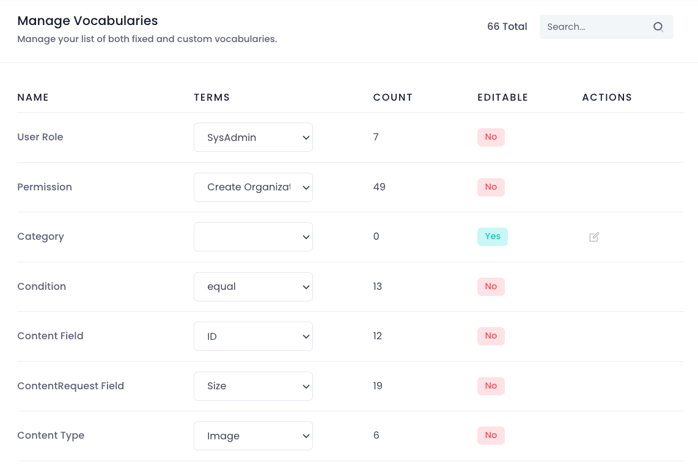
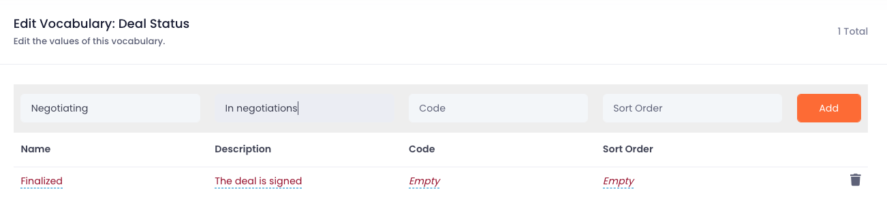
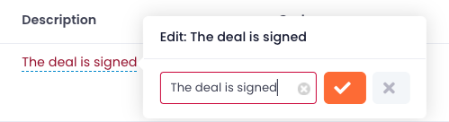

# Managing Vocabularies

Cellmobs provides a powerful and flexible way to customize and adapt your app to specific use cases and requirements by offering a combination of `SYSTEM` and `CUSTOM` vocabularies. This dual approach enables you to take full advantage of predefined vocabularies while also having the flexibility to create your own custom vocabularies as needed.

## Custom Vocabularies
In addition to `SYSTEM` vocabularies, Cellmobs allows you to create your own custom vocabularies tailored to your specific needs and requirements. `CUSTOM` vocabularies enable you to define unique terms, phrases, and labels that are relevant to your application's domain or industry. This flexibility empowers you to create a more personalized and context-aware user experience, tailored to your target audience.

To edit a custom Vocabulary navigate to `/admin/vocab/list` in the console of your app.

<figure markdown>
{loading=lazy}
    <figcaption>Vocabularies</figcaption>
</figure>

1. All editable Vocabularies will be labeled  Yes, those that are not will be  No

2. To edit a `CUSTOM` Vocabulary click the edit icon in the ACTIONS column

3. This will open the Vocabulary editor screen

4. Each Voculary entry (aka `TypeValue`), requires at minimum a Name. All other fields are options. 

<figure markdown>
{loading=lazy}
    <figcaption>Edit Vocabulary</figcaption>
</figure>

5. Use the form above to add new entries, or click on the values of an existing field (red dotted) to edit its value.

<figure markdown>
{width="80%",loading=lazy}
    <figcaption>Edit Vocabulary Field</figcaption>
</figure>

## System Vocabularies
These are predefined vocabularies provided by Cellmobs that cover common scenarios and use cases. They cannot be edited. `SYSTEM` vocabularies include terms and phrases that are commonly used across the platform, such as labels for buttons, form elements, navigation menus, and other UI components. 

## List of Vocabularies 

| Name | Description | Editable | 
| ----------- | ---------- | :-----------: | 
| [`ACL_PERMISSION`](/setup/security/#available-permissions) | ACL Permissions  |   |
|`ACL_ROLE`| Organization ACL Roles  |  :material-check: |
|`CATEGORY`| `deprecated` |  :material-check: |
|`CONDITION`| Logical operators EQ, NEQ etc. |   |
|`CONTENT_FIELD`| |  :material-check: |
|`CONTENT_REQUEST_FIELD`| |  :material-check: |
|`CONTENT_TYPE`| The primary Content `IMAGE`, `VIDEO` etc. |   |
|`COUNTRY`| |  :material-check: |
|`CURRENCY_ISO_CODE`| |  :material-check: |
|`DEAL_STATUS`| The status of an agreement between Organizations | :material-check:  |
|`DIRECTION`| |  :material-check: |
|`DISTANCE_UNIT`| |  :material-check: |
|`EDITOR_TYPE`| The web page editor type |  |
|`ENTITY_STATUS`| The status of an entity | |
|`ENTITY_TYPE`| The entity type   |   |
|`EVENT_STATUS`| |  :material-check: |
|`EVENT_TYPE`| |  :material-check: |
|`FEATURE_TYPE`| |  :material-check: |
|`FILE_TYPE`| The type of Content file |  :material-check: |
|`FREIGHT_TYPE`| |  :material-check: |
|`IDENTITY_TYPE`| |  :material-check: |
|`INCOTERM_TYPE`| |  :material-check: |
|`INTERVAL_TYPE`| |  :material-check: |
|`INVENTORY_STATUS`| |  :material-check: |
|`INVITE_STATUS`| |  :material-check: |
|`JOB_TYPE`| |  :material-check: |
|`LEAD_FIELD`| |  :material-check: |
|`LEAD_REQUEST_FIELD`| |  :material-check: |
|`LEAD_TYPE`| |  :material-check: |
|`LOCATION_TYPE`| |  :material-check: |
|`ORDER_STATUS`| |  :material-check: |
|`ORGANIZATION_ROLE`| |  :material-check: |
|`ORGANIZATION_TYPE`| |  :material-check: |
|`PAGE_TYPE`| |  :material-check: |
|`PORT`| |  :material-check: |
|`PRICE_TYPE`| |  :material-check: |
|`PRODUCT_CODE_TYPE`| |  :material-check: |
|`PRODUCT_FIELD`| |  :material-check: |
|`PRODUCT_REQUEST_FIELD`| |  :material-check: |
|`PRODUCT_TYPE`| |  :material-check: |
|`PROFIT_TYPE`| |  :material-check: |
|`PROVIDER`| |  :material-check: |
|`RATING_TYPE`| |  :material-check: |
|`RECURRENCE_TYPE`| |  :material-check: |
|`REFERENCE_TYPE`| |  :material-check: |
|`RENDER_TYPE`| |  :material-check: |
|`RENDITION_TYPE`| |  :material-check: |
|`REQUEST_TYPE`| |  :material-check: |
|`REQUIREMENT_REQUEST_FIELD`| |  :material-check: |
|`RESULT_STATUS`| |  :material-check: |
|`RESULT_TYPE`| |  :material-check: |
|`ROUNDING_MODE`| |  :material-check: |
|`STATE`| |  :material-check: |
|`TAG_TYPE`| |  :material-check: |
|`TASK_STATUS`| |  :material-check: |
|`TASK_TYPE`| |  :material-check: |
|`TAX_LEVEL`| |  :material-check: |
|`TAX_STATUS`| |  :material-check: |
|`TAX_TYPE`| |  :material-check: |
|`TEMPLATE_TYPE`| |  :material-check: |
|`UNIT_TYPE`| |  :material-check: |
|`VOCABULARY_TYPE`| |  :material-check: |
|`WEBPAGE_FIELD`| |  :material-check: |
|`WEBPAGE_REQUEST_FIELD`| |  :material-check: |
|`WEIGHT_UNIT`| |  :material-check: |
|`WORK_TYPE`||

  