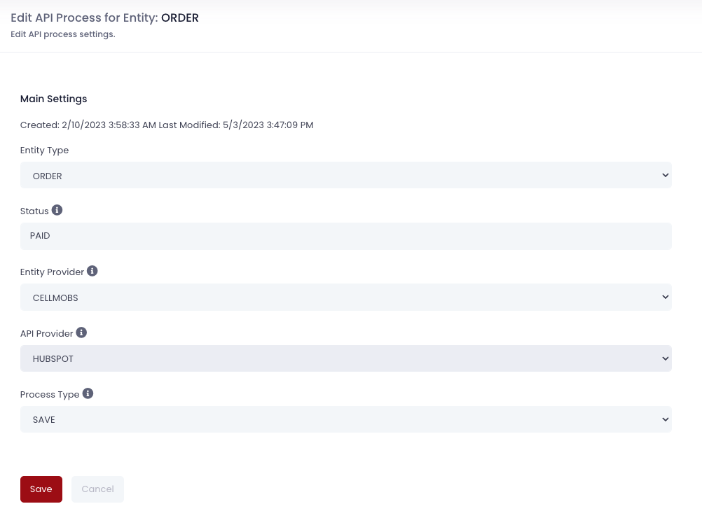
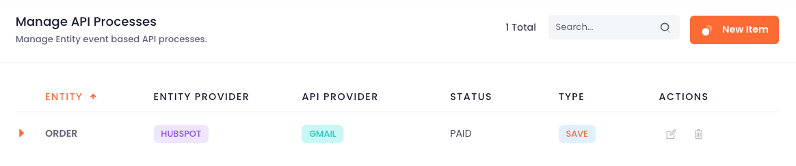
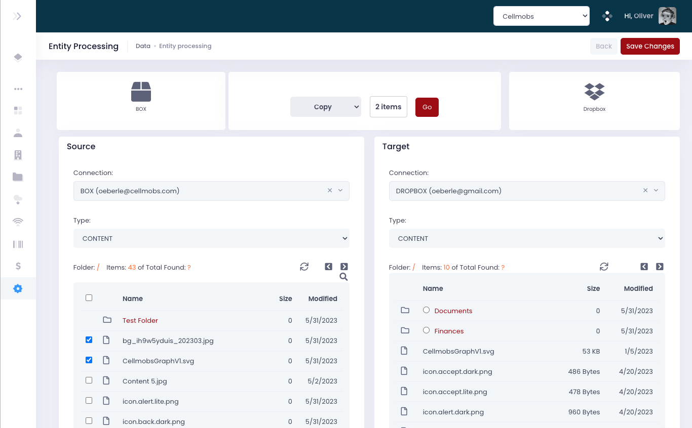
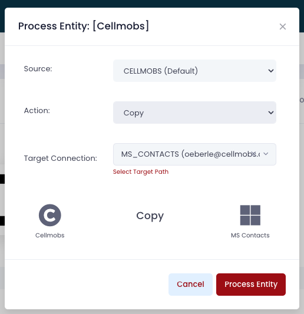

# Workflow

API processes in Cellmobs provide a powerful tool for automating tasks based on the status of an entity within the system. This automation is possible due to the platform's event-driven architecture, where events are fired each time an entity is saved. 

The configuration of an API process involves setting up a sequence of tasks to be performed when a specific entity reaches a particular status. This could be statuses such as 'Approved', 'Suspended', etc. The system will then automatically trigger the associated API process when the configured conditions are met.

Furthermore, API processes are not limited to interactions within the Cellmobs platform but can also incorporate external service providers like Hubspot, Dropbox, etc., thanks to the platform's robust integration capabilities. This interplay between internal and external systems allows you to create complex workflows that span across multiple platforms.

For example, let's consider a scenario where you've configured an API process to be triggered when a new Order is received (i.e., the Order entity reaches the 'Received' status). This API process could include a task that copies the order details to Hubspot. Once this task is executed, a link is established between the two systems, enabling easy tracking and management of the order across both platforms. 

<figure markdown>
{loading=lazy}
    <figcaption>API Process Settings</figcaption>
</figure>

This functionality extends the platform's automation capabilities, enhancing efficiency and reducing the need for manual interventions. It allows you to tailor the platform to your specific business needs, creating a more streamlined and effective system.

<figure markdown>
{loading=lazy}
    <figcaption>Sample API Process List</figcaption>
</figure>

API processes in Cellmobs offer multifaceted triggering mechanisms, with one of the significant features being their interaction with entity [Requirements](/app-console/manage-requirements). Entity Requirements in Cellmobs enforce specific conditions on entity attributes to ensure data consistency and integrity. When an entity is saved, these conditions are checked and, based on the results, the entity may transition between different statuses.

Besides this automated triggering, API processes can also be manually initiated in two ways: through the entity processing control panel and the "process entity" modal. 

<figure markdown>
{loading=lazy}
    <figcaption>Entity Processing Control Panel</figcaption>
</figure>

The entity processing control panel provides a batch processing mechanism for managing entities between different API integrations. This is particularly useful when you need to handle a large number of entities simultaneously, ensuring consistency and time-efficiency.

On the other hand, the "process entity" model provides an interface for executing ad hoc API processes for individual entities. This gives you the flexibility to trigger processes as required, allowing for specific, one-off operations that may not be covered by your existing workflows.

<figure markdown>
{loading=lazy, width="300"}
    <figcaption>Process Entity Icon</figcaption>
</figure>

<figure markdown>
{loading=lazy}
    <figcaption>Adhoc Entity Processing</figcaption>
</figure>

This combination of automated and manual triggers gives you complete control over your API processes, ensuring that they can be effectively managed to meet the unique needs of your business.

  