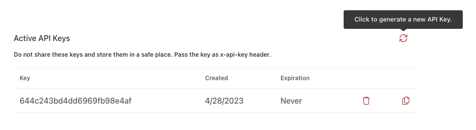

# Authentication

The Cellmobs API security is designed to provide robust protection and ensure the integrity of all API requests. To achieve this, the platform employs a two-fold security mechanism that requires both a valid API Key and a valid JSON Web Token (JWT) to be passed with each API request.

## API Key

The API Key is a unique identifier that is associated with your account or application. To authenticate your API requests, you must include the API Key as a password in the 'x-api-key' header. This key serves as a primary layer of authentication, verifying that the request is coming from a legitimate source with the necessary credentials to access the API.

## JWT Token

In addition to thes API Key, the Cellmobs API security also requires a valid JWT token for each request. The JWT token is a compact, URL-safe means of representing claims to be transferred between two parties. You need to pass the JWT token in the 'Authorization' header of the API request as `Bearer` token. The token ensures that the user making the request has the appropriate permissions and validates their identity.

## How to Authenticate

By employing this two-fold security mechanism, the Cellmobs API ensures that only authorized users with the correct credentials can access and interact with the platform's resources. 

#### Step 1: Create an API Key

To create an API Key go the [Apps Section](https://www.cellmobs.com/apps){:target="_blank"} and choose the app for which you want to generate a new key. If you don't have an app yet we suggest you consult our [Quickstart Guide](/setup/quickstart).

<figure markdown>
{loading=lazy}
    <figcaption>Apps: Active API Keys</figcaption>
</figure>


#### Step 2: Authenticate to get a valid JWT Token

To obtain a JWT token simply [Login](https://api.cellmobs.com/#f42c872d-7c67-4db3-976c-889963ea979d){:target="_blank"} with an active application user.  

You can use our [postman collection](/guide/using-postman) or try the [API sandbox](/guide/api-sandbox). 

``` py title="Login"
curl --location 
--request POST 'https://web.cellmobs.com/v1/auth/login?username={email}&password={password}' \
--header 'x-api-key: my-api-key'

```
<br>

## reCAPTCHA
reCAPTCHA: reCAPTCHA is a security feature designed to protect web applications from automated bots and spam. It works by presenting users with a challenge, usually in the form of distorted text, images, or puzzles, that they must solve to prove they are human. The benefits of reCAPTCHA include:

-  Preventing automated bots from accessing your app, which can lead to security vulnerabilities, data breaches, and unwanted spam.
-  Reducing the risk of fraudulent activities, such as fake sign-ups, spam comments, and fake transactions.
-  Improving the overall security and user experience of your application by keeping bots and spam at bay.


## Multi-Factory Authentication (MFA)
Multi-Factor Authentication (MFA): MFA is a security process that requires users to provide multiple forms of identification before gaining access to their accounts or sensitive data. This typically involves a combination of something the user knows (password), something the user has (a physical token, smartphone), and something the user is (biometric data). The benefits of MFA include:

- Enhanced account security by making it more difficult for attackers to gain unauthorized access, even if they obtain a user's password.
- Protecting sensitive data and critical app functionality from unauthorized access, reducing the risk of data breaches and other security incidents.
- Providing an additional layer of security for users, especially in situations where passwords may be weak or compromised.

Cellmobs recognizes the importance of robust security measures, and as such, offers Multi-Factor Authentication (MFA) support through both the Google Authenticator App and text messages, utilizing its integration with Twilio. This dual support ensures that users can choose the method that best suits their preferences and needs, further enhancing the security of their accounts. 

Here's how Cellmobs supports MFA through these two methods:

### Google Authenticator App
The Google Authenticator App is a popular choice for implementing MFA because it generates time-based one-time passwords (TOTPs) on the user's smartphone. When users enable MFA using the Google Authenticator App, they'll be prompted to scan a QR code or enter a secret key into the app. Once set up, the app generates a unique, temporary code every 30 seconds. Users will be required to enter this code when logging in, along with their usual password. This additional layer of security ensures that even if a user's password is compromised, the attacker would still need the time-sensitive code from the Google Authenticator App to gain access to the account.

### Text Messages (SMS) with Twilio Integration
Cellmobs also supports MFA via text messages through its integration with Twilio, a leading cloud communications platform. When users enable MFA using this method, they'll be required to provide their mobile phone number. Upon login, after entering their password, they will receive a unique, temporary code via text message. This code must be entered to gain access to their account. 

<br>

!!! Note
    Cellmobs requires the implementation of reCAPTCHA and MFA to ensure that the platform and the applications built on it are secure and resilient against threats. By incorporating these security measures, Cellmobs provides a robust and reliable environment for developers and users, ensuring the safety and integrity of the applications and data hosted on the platform.

<br>

## SAML Support

SAML support is currently under development and will be available soon.

## Rate Limiting

Cellmobs employs a rate limiting mechanism using token bucket allocation to manage and control the rate at which API requests are processed for each app. This method helps maintain the stability and performance of the platform, ensuring a consistent and reliable experience for our customers and their users.

By default, each app is allocated 1,000 tokens per minute, meaning that it can make up to 1,000 API requests within a 60-second window. The token bucket allocation operates on a rolling basis, replenishing tokens at a constant rate, and allowing unused tokens to carry over to the next minute, up to the maximum limit.

If the default allocation of 1,000 tokens per minute is not sufficient for your app's needs, you can request an increase in your token limit by [opening a support ticket](https://www.cellmobs.com/support). Our support team will evaluate your request and, if approved, increase the token allocation to better accommodate your app's requirements.

This approach to rate limiting ensures fair resource usage among all apps on the Cellmobs platform while providing the flexibility for subscribers to request adjustments based on their specific needs.

<br>
