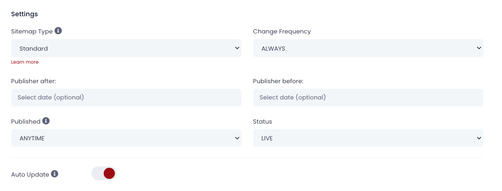
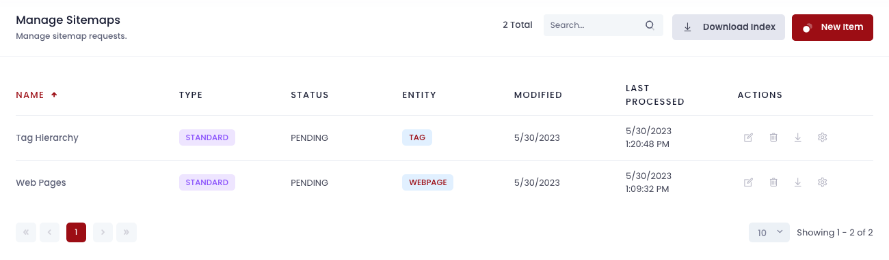

# SEO

Guide will be availble soon!

## Page Metadata
Guide will be availble soon!

## Page Urls
Guide will be availble soon!

## Server Side Rendering
Guide will be availble soon!

## Analytics
Guide will be availble soon!

## Sitemaps

Cellmobs provides an inbuilt Sitemap generator, which is a crucial tool for optimizing search engine indexing and enhancing the discoverability of your application's content. 

The Sitemap generator supports various Cellmobs entities, including Web Pages, Products, Content, and Tags. With this, you can automatically create XML sitemaps which include all relevant URLs along with additional metadata about each URL. This metadata can contain details like when the URL was last updated, how frequently it changes, and its importance relative to other URLs in your app.

One of the main benefits of the Sitemap generator is the ability to schedule automatic regeneration of your sitemaps. This feature ensures that as you add, modify, or remove content on your app, your sitemaps stay up-to-date, accurately reflecting your app's content structure to search engines.

<figure markdown>
{loading=lazy}
    <figcaption>Configure Sitemaps Rules</figcaption>
</figure>

Additionally, the Sitemap generator also creates a sitemap index file. This file acts as a reference guide to all your individual sitemaps and is especially useful for larger apps with extensive content. The generated sitemap index can be directly submitted to Google and other search engines supporting XML sitemaps. 

When the sitemap or sitemap index file is generated, you can opt to have it automatically uploaded to your web application or manually downloaded it to manual update your applications.

<figure markdown>
{loading=lazy}
    <figcaption>Manage &amp; Download Sitemaps</figcaption>
</figure>

  