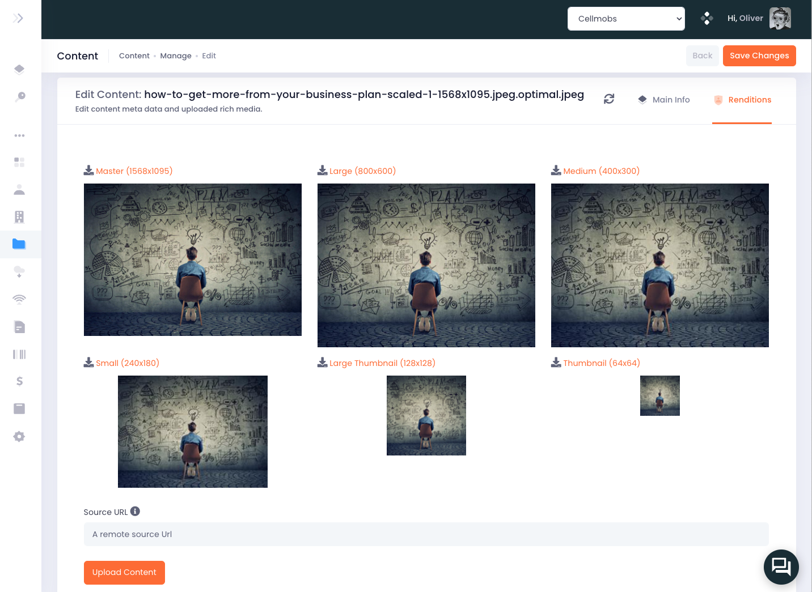

# Image Settings

Developers using Cellmobs can define **ImageSettings** for different application **FileTypes** to ensure that their applications display images in the desired format, size, and quality. Image Settings are associated with an Organization and provide a flexible way to configure multiple image renditions for various use cases and device types. 

Depending on your application requirements, there is no limit to the number of Image Settings that can be configured, allowing for maximum flexibility in managing image renditions for different FileTypes.

## File Types

`FILE_TYPE` is a Cellmobs [Vocabulary](/app-console/manage-vocabularies), and while new file types can be added and removed, there are a set of `SYSTEM` file types that each application should retain as they are used throughout the platform. 

<figure markdown>
{loading=lazy}
    <figcaption>File Types</figcaption>
</figure>

### System File Types 

| FileType |  Description |
| ----------------- | ----------- 
| `CUSTOM_IMAGE` | Custom Image is the default file type images are uploaded and the main tyoe for [WebPage](/app-console/manage-pages) images.  | 
| `PRODUCT_IMAGE` | Product Image is the expected format for images associated with [Products](/app-console/manage-products) | 
| `TAG_IMAGE` | Tag Images are an optional image types associated with [Tags](/setup/setting-up-tags) | 
| `ORGANIZATION_LOGO`| The default file type for [Organization](/app-console/manage-organizations) logos | 
| `IDENTITY_AVATAR` | The default file type for [User](/app-console/manage-users) profile images | 
| `SECURE_FILE` | The default file type for files that are only available to users withe the proper [Organization role](/setup/security/#organization-roles) | 

## Configuring Image Renditions 

<figure markdown>
{width="90%",loading=lazy}
    <figcaption>Configure Image Renditions</figcaption>
</figure>

Each `FILE_TYPE` has a set of five renditions. Each rendition consists of an image MIME type (e.g., JPEG, PNG) and corresponding image dimensions (e.g., width and height). Developers can configure Image Settings for specific use cases, or adjust the setting of the `SYSTEM` file types (Organization Logos, User Avatars, Product Images, and Custom Images) to their app and device type requirements. 

<figure markdown>
{loading=lazy}
    <figcaption>Image Rendition Sample</figcaption>
</figure>

  

