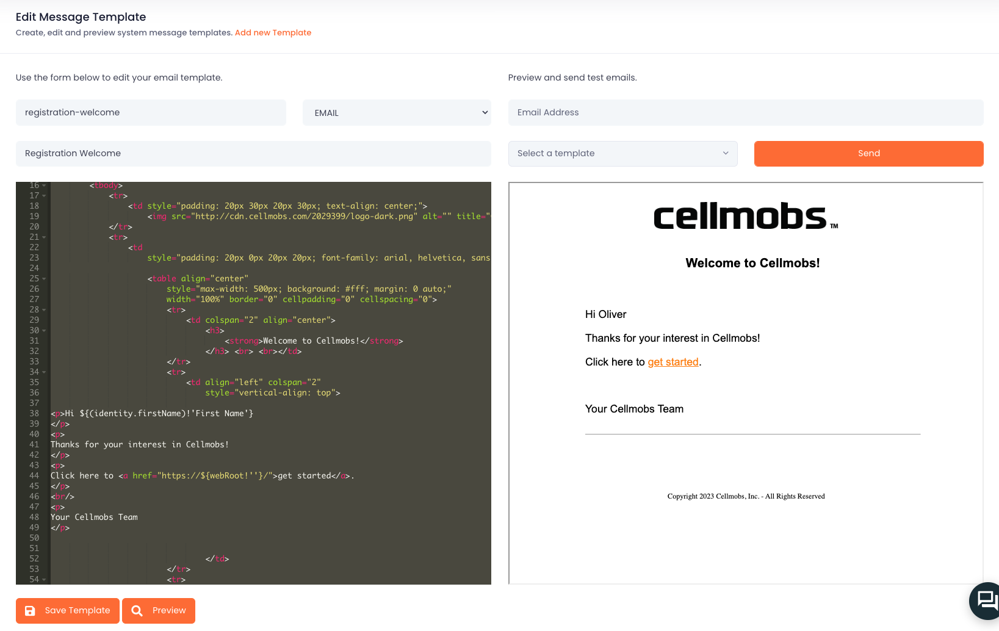

# Message Templates
Cellmobs currently supports three different message types to cater to various communication needs within applications. These message types include Emails, SMS/Text messages, and internal messages, which can be used for User-to-User and Organization-to-User communications, as well as general system notifications. 

!!! info    
    Push notifications and integrations with third party messaging platform are in development and will be available later this year. 

The messages are sent based on platform and application events, some of which can be configured, while others are native to the Cellmobs platform. 

Here's an overview of each message type:

### Emails
Email messages are the default communication method for delivering important information, updates, and notifications. Cellmobs supports sending email messages to users based on triggered events within the application, such as account registration, password resets, and promotional updates. Developers can customize the email templates, ensuring that the content aligns with the application's branding and communication strategy.

Emails are sent via [AWS's Simple Email Service (SES)](https://aws.amazon.com/ses/) and as such require you to validate a valid email address with SES if you would like to [use your own email for delivering email messages](/setup/global-settings) to your users.    

### Text Messages
SMS/Text messages: SMS or text messages offer a fast and direct way to communicate with users. Cellmobs supports sending SMS messages based on application events, such as order confirmations, account verification codes, and time-sensitive alerts. Integration with Twilio ensures reliable and prompt delivery of SMS messages to users' mobile devices, enhancing user engagement and responsiveness.

To get started with text messages be sure to signup with Twilio to obtain API credentials [api token](https://www.twilio.com/docs/iam/access-tokens){:target="_blank"} and configure them as [global settings](/setup/global-settings) in your app.

### Internal Messages (IM)
Internal messages are an essential component of User-to-User and Organization-to-User communication within the Cellmobs platform. These messages facilitate direct communication between users, as well as between an organization and its users. Internal messages can be used for a variety of purposes, including support requests, user feedback, or system notifications (e.g., activity confirmations, upcoming maintenance or new feature announcements).

## Editing Templates

All message templates in Cellmobs are based on the [Freemarker](/technologies/#freemarker) template format, a widely-used, powerful, and flexible template engine for Java-based applications. Freemarker enables developers to create dynamic and customizable message templates for Emails, SMS/Text messages, and internal messages, ensuring consistent and engaging communication experiences within their application (see Technologies for more details).

<figure markdown>
{loading=lazy}
    <figcaption>Message Template Editor</figcaption>
</figure>

Click here for more details on how to [Manage Templates](/app-console/manage-templates) and how to create custom templates and use them in your application. 

### System Templates 

| Template | Type | Subject |
|-------------|-----------|----------|
|`account-invitation`|`EMAIL`|Account Invitation|
|`contact-me-auto-reply`|`EMAIL`|Auto Reponse to Contact Form|
|`datapoint-api-request-limit-alert`|`EMAIL`|API Requests Limit Reached|
|`contact-request-alert`|`EMAIL`|Contact Request Alert|
|`datapoint-dns-not-found-alert`|`EMAIL`|DNS Not Found|
|`datapoint-db-storage-alert`|`EMAIL`|DataPoint DB Storage Low Alert|
|`datapoint-file-storage-alert`|`EMAIL`|File Storage Low|
|`datapoint-free-tier-exceeded-alert`|`EMAIL`|Free Tier Exceeded|
|`datapoint-many-errors-alert`|`EMAIL`|Too Many Errors Alert|
|`datapoint-service-impaired-alert`|`EMAIL`|Service Impaired|
|`general-custom-email`|`EMAIL`|General Custom Email|
|`im-entity-process-alert-failure`|`IM`|Entity Process Failed!|
|`im-entity-process-alert-success`|`IM`|Entity Process Success!|
|`order-maintenance-work-order`|`EMAIL`|Maintenance Work Order|
|`organization-email-share`|`EMAIL`|Organization Email Share|
|`organization-invite`|`EMAIL`|Organization Invite|
|`organization-invite-accept`|`EMAIL`|Organization Invite Accept|
|`organization-join-confirmation`|`EMAIL`|Join Organization Confirmation|
|`organization-join-request`|`EMAIL`|Join Organization Request|
|`organization-message`|`EMAIL`|Organization Message|
|`organization-message-confirmation`|`EMAIL`|Organization Message Delivery Confirmation|
|`organization-order-alert`|`EMAIL`|Booking Alert aka Organization Order Alert|
|`organization-order-approval-request`|`EMAIL`|Organization Order Approval Request|
|`organization-order-confirmation`|`EMAIL`|Organization Order Confirmation|
|`organization-order-invoice`|`EMAIL`|Organization Order Invoice Link|
|`organization-order-no-payment-method`|`EMAIL`|No Valid Payment Method|
|`organization-order-transaction-receipt`|`EMAIL`|Order Transaction Receipt|
|`organization-role-change`|`EMAIL`|Organization Role Change|
|`organization-subscription-cancellation`|`EMAIL`|Organization Subscription Cancellation |
|`organization-subscription-trial-ends`|`EMAIL`|Organization Subscription Trial Ends|
|`organization-subscription-update`|`EMAIL`|Organization Subscription Update Confirmation|
|`organization-transaction-receipt`|`EMAIL`|organization-transaction-receipt|
|`password-reset`|`EMAIL`| Password Reset Confirmation|
|`password-reset-request`|`EMAIL`|Password Recovery|
|`password-reset-request-console`|`EMAIL`|Password Recovery|
|`registration-confirmation`|`EMAIL`|Registration Confirmation|
|`registration-welcome`|`EMAIL`|Registration Welcome|
|`share-inbox`|`EMAIL`|Share Identity Inbox|
|`tell-a-friend`|`EMAIL`|Tell a Friend|
|`usage-file-storage-alert`|`EMAIL`|DataPoint File Storage Alert|

  