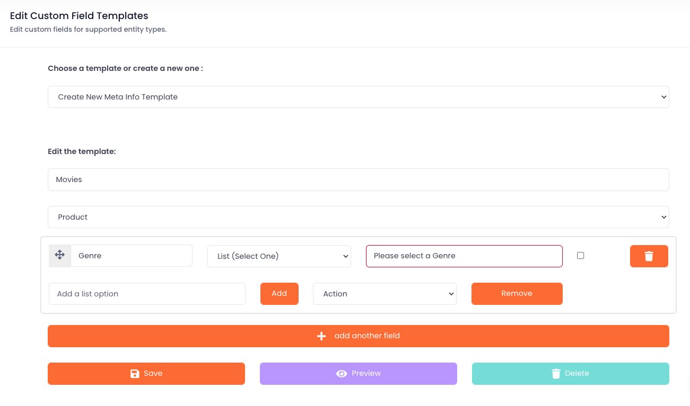

# Data Model &amp; Schema

Cellmobs offers a highly flexible core data model, consisting of commonly used entities such as Identities (Users), Organizations, Products, Content (Files), and more. This flexibility allows users to build a wide range of applications tailored to their specific requirements. 

| EntityType | Description |
|-----------------|-----------------|
|`ACLROLEORGANIZATION`| Defines the role of an `IDENTITY` in an `ORGANIZATION` |
|`APIKEY`| The properties and value of an API Key |
|`CALENDAR_EVENT`| A Calendar Event  |
|`CART`| A shopping cart associated with an `ORDER`|
|`CHANNEL`| A syndication channel configuration |
|`CONTENT`| A file of a certain [content type](/app-console/manage-content/#content-types) |
|`DEALTERMS`| The terms of an agreement between two or more parties |
|`FEATURE`| A `PRODUCT` features |
|`FEED`| An aggregation feed configuration |
|`IDENTITY_ACCOUNT`| Payment information, Credit Card or Bank Account|
|`IDENTITY_CONNECTION`| Credentials for an API Integration |
|`IDENTITY`| A [user](/app-console/manage-users), person, individual |
|`IMAGE_SETTINGS`| Rendition settings for a `FILE_TYPE`|
|`INBOX_ITEM`| An email, notification, or chat message |
|`INVITE`| An invitation for an `IDENTITY` to an `ORGANIZATION` |
|`LEAD`| A business lead or contact request |
|`LEDGER_ENTRY`| A entry in the revenue `LEDGER` of an `ORGANIZATION` |
|`LEDGER_REPORT`| A report generated from a `LEDGER`. |
|`LEDGER`| A revenue and cost ledger of an `ORGANIZATION`|
|`LOCATION`| A geo location of a certain LocationType: RESIDENCE, OFFICE, etc.|
|`MODEL`| A custom data model |
|`OAUTH_APP`| The credential for and OAuth API Integration |
|`ORDER`| An order with a `CART` that contains `PRODUCT`|
|`ORGANIZATION`| An [organization](/app-console/manage-organizations) or group of some kind |
|`PAYMENT_PROCESSOR`| The configuration and credentials for a payment gateway|
|`PAYTRANSATION`| A payment transaction |
|`POLL`| A poll with one or more questions |
|`PRODUCT`| A [product](/app-console/manage-products), a good or service |
|`PROJECT`| A project, that contains multiple `WORK` units |
|`PROMOTION`| A product promotion that can be applied to an `ORDER`|
|`RATING`| A entity rating of a certain type e.g. `PRODUCT` star rating  |
|`REFERENCE`| Defines an arbitrary relationship between two entities|
|`REQUIREMENT`| Defines the field value requirements for entities and validation workflow|
|`RESERVATION`| A `Product` reservation |
|`REWARD_TRIGGER`| Defines what triggers an `IDENTITY` reward attribution  |
|`REWARD`| A reward for `WORK` that is triggered by a `REWARD_TRIGGER`|
|`SUBSCRIPTION_PLAN`| A subscription plan consisting of one or more `PRODUCTS` |
|`SUBSCRIPTION`| A [subscription](/app-console/manage-subscriptions) of an `IDENTITY` to a `SUBCRIPTION_PLAN` |
|`TAG`| A [tag](/setup/setting-up-tags) (category or label) associated with an entity |
|`TAX`| Defines a tax or fee aassociated with a `PRODUCT` or `ORDER`|
|`TENANT`| A tenant also knows as a Cellmobs App |
|`TYPEVALUE`| A configured value of a [Vocabulary](/app-console/manage-vocabularies) |
|`WEBPAGE`| Defines the content of a [web page](/app-console/manage-pages) |
|`WEBTEMPLATE`| A email, web, or report [template](/app-console/manage-templates) |
|`WORK`| Defines task aka story, ticket typically associated with a `PROJECT` |

The core data model can be extended in two ways: Custom Field Templates and custom Models.

## Custom Field Templates

Custom Field Templates provide a convenient way to extend existing model classes with additional fields. Users can define sets of fields as templates that can be attached to new or modified entities. This allows users to add custom attributes to entities, enabling them to capture and store additional information specific to their application's requirements. Custom Field Templates make it easy to expand the core data model without the need for complex code modifications or database schema changes.

Click here to learn how to [configure customer field templates](/app-console/manage-templates/#custom-fields).

<figure markdown>
{loading=lazy}
    <figcaption>Custom Field Templates</figcaption>
</figure>

## Entity Requirements

In addition to extending the core data model, Cellmobs supports Entity Requirements, a feature designed to validate entity field values based on configurable business rules in support of certain use cases and [workflows](/setup/setting-up-workflow). 

Entity Requirements help ensure data consistency and integrity by enforcing specific conditions and constraints on entity attributes. This allows users to maintain high-quality data in their applications, ultimately improving the overall user experience and reliability of the system.

<figure markdown>
{loading=lazy}
    <figcaption>Entity Requirements Example</figcaption>
</figure>

Click here to learn how to [configure entity requirements](/app-console/manage-workflow).

## Custom Models

For more advanced use cases, Cellmobs allows users to create entirely custom Models. This feature provides even greater flexibility, enabling users to define their own entity types with custom attributes, relationships, and behavior. Custom Models can be used alongside the core data model to build sophisticated applications that cater to unique business requirements. 

Custom Models are still in the experimental stage and will be rolled out later this year. 

  