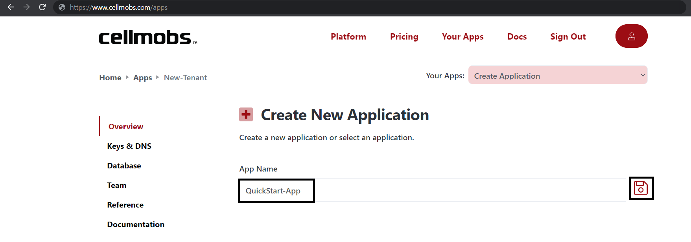
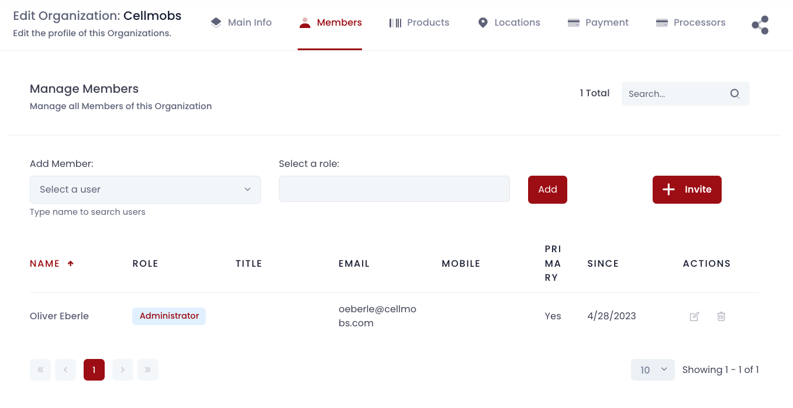

# Quick Start

Welcome to the Cellmobs QuickStart Guide! This guide is your stepping-stone to building and deploying your very own web application on the Cellmobs platform.

By the end of this guide, you'll be familiar with the essential steps to get started with Cellmobs. We'll walk you through:

1. **Signing Up**: How to sign up for a free Cellmobs account.
2. **Creating an App**: How to create your first application using Cellmobs platform.
3. **Verifying DNS Entries**: We'll guide you on how to verify the DNS entries for your newly created app, a crucial step for it to be accessible on the web.
4. **Generating API Key**: You'll learn how to create an API key, which acts as a unique identifier and authorizer for your app.
5. **Logging into App Console**: Accessinf the App Console, which is your control room for managing the app.
6. **Inviting Team Members**: Collaborating on an application is made easy with Cellmobs. We'll show you how to invite team members to your app.
7. **Configuring the App**: Finally, we'll get you started on configuring your application to meet your specific requirements.

This QuickStart Guide is intended to provide a concise overview of the Cellmobs platform's basics. For a deeper dive into each topic, we encourage you to explore the developer documentation. 

Now, let's get started with building your first application on the Cellmobs platform!

___
## Creating an account

Cellmobs offers a free tier to get you started right away. No credit card required.

- To sign up, navigate to [Cellmobs Sign-up Page](https://www.cellmobs.com/signup).

<figure markdown>
{loading=lazy}
    <figcaption>Sign Up Form</figcaption>
</figure>  

## Creating your first app
- Login at the [Cellmobs Login Page](https://www.cellmobs.com/login) with your email and password.
- Click on the "[Your Apps](https://www.cellmobs.com/apps)" option on the navigation bar.

<figure markdown>
{loading=lazy}
    <figcaption>Create an App</figcaption>
</figure>  

- Enter your **application name** and click on the save button. Application names are normalized e.g. **My New App** will be normalized to **my-new-app**

## Verify your App DNS
- Select your newly created application from the dropdown menu and navigate to the "Keys and DNS" section.
- Provided everything went well, your should see a list of 3 host names under Endpoints. 
    - **Console:** This is where your App administration console will live.
    - **Web API:** This is the API host for your application's [REST API](https://api.cellmobs.com){:target="_blank"}.
    - **Webhook:** This your main webhook host, in case you want to configure integrations with webhook support for your app.

<figure markdown>
{loading=lazy}
    <figcaption>Your App DNS </figcaption>
</figure>  

Copy and paste the urls in your browser to verify that each host is responding. 

The console will present you with a login screen, while the API and the Webhook host should respond with `I'm alive!`.

## Manage your API Keys
You can create and remove API keys that you need to authenticate your app API requests when calling Cellmobs APIs.

- Navigate to the "Keys and DNS" section.
- In the Active Api Keys sub-section, click on the refresh icon to generate a new API key.

<figure markdown>
[![Create Key]][Create Key]
    </figure>

  [Create Key]: ../assets/screenshots/quickstart/create-api-key.png

- Copy the key and store it in a safe location.

<figure markdown>
{loading=lazy}
    <figcaption>Your API Keys</figcaption>
</figure>  

- Click the trashcan to delete an API key after you rotated your keys, but be sure that they are no longer used by a live application.

 

!!! tip  
    Key rotation reduces the risk associated with a key becoming compromised, as even if a key is leaked or stolen, it will only be useful for a limited period. However, it does add complexity to the application management and requires systems to handle key updates smoothly. Therefore, implementing an automatic key rotation system can be very beneficial to manage this process efficiently.

___

## Login to your App Console

<figure markdown>
{loading=lazy}
    <figcaption>App Console Login</figcaption>
</figure>  

To [login to your app console](/app-console/console-login/) and to learn how to configure and manage your application please consult the [App Console user guide](/app-console/console-overview/).

## Invite your Team

You can invite members from your team to collaborate and manage your application through the "App Console". 

- Navigate to the Organization sections of the console and locate your "Primary Organization" (aka "[Your App Organization](/setup/your-app-organization)"). Whenever you create a new App, we automatically copy your Cellmobs account credentials to that new app along with your organization.   

<figure markdown>
{loading=lazy}
    <figcaption>Organizations</figcaption>
</figure>  

- Click to view and edit Your App Organization.   
- Click the "Members" tab to view your Team Members. When you first create a new App, you should only see yourself listed.   

<figure markdown>
{loading=lazy}
    <figcaption>Organization Members</figcaption>
</figure>  

- There are several ways to add new members to an organization but the quick way is to send them an email invitiation. 
      - For more on how to configure new users and how to assign them to different organizations consult the [App Console user guide](/app-console/console-overview/).
- Click the "Invite" button to open the invitation form.   

<figure markdown>
{loading=lazy}
    <figcaption>Invite Team Members</figcaption>
</figure>  

- You can invite team members in two ways: at the application level or the organization level, each with distinct roles.
    - **Application level invitation:** You can invite a new team member directly to the application. In this case, you would assign them a 'global' application role. The global role outlines what permissions the team member has across the entire application. For example, a 'ROLE_EDITOR' may be allowed to make changes to content across the application, while a 'ROLE_DEVELOPER' might have access to modify templates and settings.
    - **Organization level invitation:** Alternatively, you can invite a team member to a specific organization within the application. When you do this, you assign them a specific role within that organization. The organization role dictates what the team member can do within that specific organization. Organization are configurable while Global Roles are not (see [Security](/setup/security) for more). 

## Database
Cellmobs provides a fully managed database solution through [MongoDB Atlas](https://www.mongodb.com/){:target="_blank"}. Databases are replicated across multiple regions and backed up continously. They will be scaled on demand and according to your usage.

<figure markdown>
{loading=lazy}
    <figcaption>Your Database</figcaption>
</figure>  

To request a personal login to your database, please contact [support](https://www.cellmobs.com/support) and open a support ticket. Personal logins will allow you to use popular MongoDB client tools like MongoDB Compass or Studio3T. Personal database login credentials are only available to paid subscriptions.

  