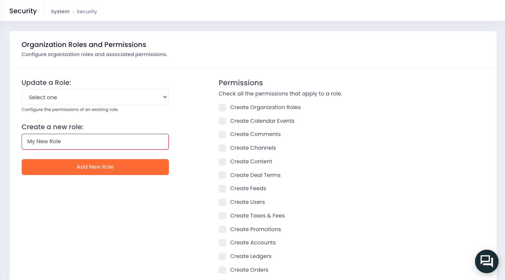

# Security

At Cellmobs, we take the security of our platform, APIs, and data very seriously. We understand the importance of safeguarding your information and have implemented rigorous measures to ensure a secure environment for all our customers.

Our security stance encompasses multiple layers of protection, including encryption of data in transit and at rest, field-level encryption of particularly sensititive data, regular security audits, and adherence to industry best practices. We follow the principles of least privilege and role-based access control to restrict access to sensitive data and resources only to authorized personnel.

In addition, our APIs are designed with security in mind, incorporating strong authentication and authorization mechanisms to prevent unauthorized access. We regularly monitor and update our platform to address emerging threats and vulnerabilities, ensuring that your data and applications remain protected at all times.

## Global Roles

Global user roles are an essential component of access control as they define the level of access and permissions granted to users based on their role within the context of an application. There are seven predefined global roles that determine user access to various parts of the system. These roles have been carefully designed to cater to different responsibilities and cannot be modified.

- System Administrator - `ROLE_SYSADMIN`
- Administrator - `ROLE_ADMIN` 
- Manager - `ROLE_MANAGER`
- Developer - `ROLE_DEVELOPER`
- Editor - `ROLE_EDITOR`
- User - `ROLE_USER`
- Non-User - `ROLE_NONUSER`

These global roles ensure that users can only access the features and resources relevant to their job function, thereby maintaining a secure and organized environment. As such and Users cannot login to to the app console of an application for example. And within the console certain roles have access to certain sections. 

As you onboard users onto your application, assigning them to the appropriate global role will ensure smooth and secure operation while empowering your team members to perform their tasks effectively.

Click here for more details on how to [Manage Users](/app-console/manage-users)

### App Console Access 

| Section |  Roles |
| ----------- | ----------- 
| Users | `ROLE_SYSADMIN`, `ROLE_ADMIN`, `ROLE_MANAGER (Orgs)` | 
| Organizations | `ROLE_SYSADMIN`, `ROLE_ADMIN`, `ROLE_MANAGER (Orgs)`|
| Pages  | `ROLE_SYSADMIN`, `ROLE_ADMIN`, `ROLE_MANAGER (Orgs)` |
| Revenue | `ROLE_SYSADMIN`, `ROLE_ADMIN`, `ROLE_MANAGER (Orgs)` |
| Products | `ROLE_SYSADMIN`, `ROLE_ADMIN`, `ROLE_MANAGER (Orgs)` |
| Content | `ROLE_SYSADMIN`, `ROLE_ADMIN`, `ROLE_MANAGER (Orgs)` |
| Channels | `ROLE_SYSADMIN`, `ROLE_ADMIN`, `ROLE_MANAGER (Orgs)` |
| Feeds | `ROLE_SYSADMIN`, `ROLE_ADMIN`, `ROLE_MANAGER (Orgs)` |
| Settings | `ROLE_SYSADMIN`, `ROLE_ADMIN`, `ROLE_DEVELOPER` |
| Models | `ROLE_SYSADMIN` |

!!! note
    `(Orgs)` means that a role only has access to the section in the context of its permissions assigned by its Organization roles. It will only see and be able to modify entities associated with those organizations.

## Organization Roles

Global roles and organization roles serve distinct purposes within a system, catering to different aspects of access control and user management.

Global roles are predefined roles that determine a user's access to various parts of the system at a high level. These roles are fixed and cannot be changed, as they are designed to cater to general system access and cover a wide range of functionalities. Global roles provide a baseline level of permissions and are applicable across the entire platform.

On the other hand, organization roles are fully customizable and offer app developers granular control over user access to domain objects, also known as entities, associated with a specific organization. These roles allow developers to define the exact permissions and access levels for each user within their organization, tailoring the roles to the unique requirements and structure of their business. Organization roles enable developers to create a more fine-grained and flexible access control system that aligns with their specific needs and workflows.

Global roles define general system access, while organization roles offer customizable and fine-grained control over user access within a particular organization, providing app developers with the flexibility to manage permissions in a way that best suits their specific use case.

Click here for more details on how to [Manage Organizations](/app-console/manage-organizations) 

### Configure Organization Roles

#### Step 1
To manage the Organization roles for an application login to the app console and open the `Settings` -> `Security` page. "Create a new Role" and assign the desired permissions for the role. `CREATE` permission inherit `READ` permissions so no needs to check `READ` permissions if you have the corresponding `CREATE` permission. 

<figure markdown>
{loading=lazy}
    <figcaption>Configure Organization Roles</figcaption>
</figure>

#### Step 2

Once you saved your new role, you can assign it to an Organizations using the `Member` tab in the [Organization editor](/app-console/manage-organizations).  

<figure markdown>
{loading=lazy}
    <figcaption>Configure Organization Roles</figcaption>
</figure>

## Permissions

Access Control List (ACL) permissions play a critical role in managing access to resources within the Cellmobs platform, particularly when it comes to entities associated with an organization. These permissions allow for precise control over user access and help maintain a secure environment.

ACL permissions for Cellmobs entities can be categorized into two main types: `Read` and `Create` privileges.

### Read Privileges

This type of permission grants users the ability to view and access specific entities within an organization and throughout applications. Users with Read privileges can see the information related to the entities they have access to but are not allowed to make any modifications.

### Create Privileges

This permission provides users with the rights to create, update, and delete entities associated with an organization. Users with Create permissions can add new entities, modify existing ones, and remove them from the system as needed. This level of access allows for more significant control over the entities within an organization and is typically granted to users with higher levels of responsibility.

By utilizing ACL permissions, organizations can ensure that each user has the appropriate level of access to Cellmobs entities, protecting sensitive information and maintaining a secure and efficient working environment.

### Available Permissions

- `CREATE_ACCOUNT`
- `CREATE_ACL_ROLE_ORGANIZATION`
- `CREATE_CALENDAR_EVENT`
- `CREATE_CHANNEL`
- `CREATE_COMMENT`
- `CREATE_CONTENT`
- `CREATE_DEALTERMS`
- `CREATE_FEED`
- `CREATE_IDENTITY`
- `CREATE_LEDGER`
- `CREATE_ORDER`
- `CREATE_ORGANIZATION`
- `CREATE_PAY_TRANSACTION`
- `CREATE_POLL`
- `CREATE_PRODUCT`
- `CREATE_PROJECT`
- `CREATE_PROMOTION`
- `CREATE_SETTING`
- `CREATE_SUBSCRIPTION_PLAN`
- `CREATE_SUBSCRIPTION`
- `CREATE_TAX`
- `CREATE_TENANT`
- `CREATE_WEBPAGE`
- `CREATE_WORK`
- `READ_ACCOUNT`
- `READ_ACL_ROLE_ORGANIZATION`
- `READ_CALENDAR_EVENT`
- `READ_CHANNEL`
- `READ_COMMENT`
- `READ_CONTENT`
- `READ_DEALTERMS`
- `READ_FEED`
- `READ_IDENTITY`
- `READ_LEDGER`
- `READ_ORDERS`
- `READ_ORGANIZATION`
- `READ_PAY_TRANSACTION`
- `READ_POLL`
- `READ_PRODUCT`
- `READ_PROJECT`
- `READ_PROMOTION`
- `READ_SETTING`
- `READ_SUBSCRIPTION_PLAN`
- `READ_SUBSCRIPTION`
- `READ_TAX`
- `READ_TENANT`
- `READ_WEBPAGE`
- `READ_WORK`
- `SECURITY_ADMIN`

