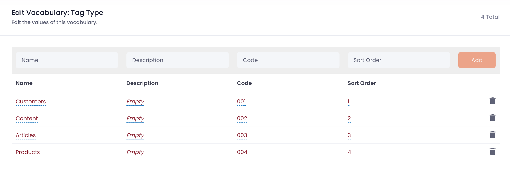
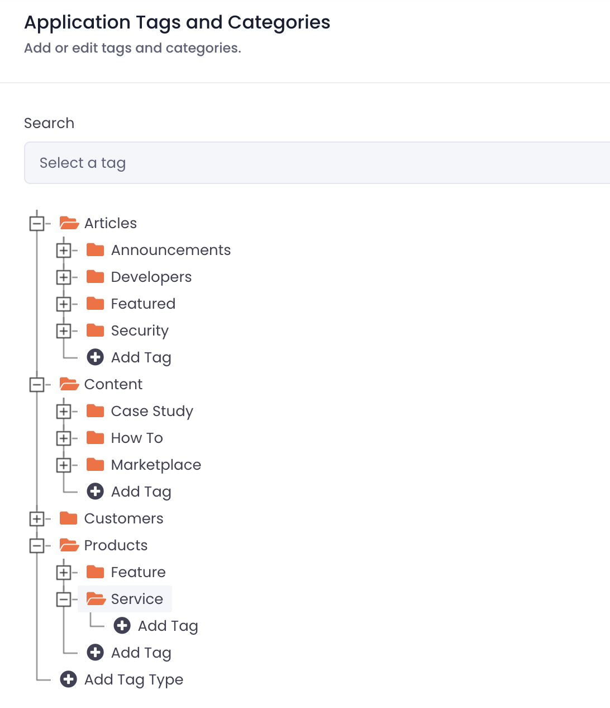

# Setting up tags

Cellmobs Tags are a versatile and powerful feature that can be utilized in various ways to enhance the organization and functionality of your app. By leveraging Tags, you can create custom structures, categorize content, and establish relationships between different elements within your application. Some common use cases for Cellmobs Tags include:

- **App Navigation:** Tags can be used to define the navigation structure of your app, allowing users to easily navigate between different sections or categories. By associating Tags with specific pages, views, or components, you can create a user-friendly and intuitive navigation experience.
- **Content Categorization:** Tags are an effective way to categorize and organize content within your app, such as articles, products, or services. By assigning relevant Tags to different content elements, users can easily search for, filter, and discover content that matches their interests or requirements.
- **Product Category Hierarchy:** In the case of a multi-vendor marketplace or e-commerce platform, Tags can be used to create a hierarchical structure for product categories. This hierarchy allows users to browse and explore products based on their categories and subcategories, simplifying the browsing experience and enhancing product discoverability.
- **Organizing and Labeling Data:** Tags can be associated with most Cellmobs entities, enabling you to organize and label your data in a manner that best suits your application's use cases. Whether you need to group related entities, highlight specific attributes, or create custom segments, Tags offer the flexibility to tailor your data organization to your unique requirements.

By incorporating Cellmobs Tags into your app, you can create a more organized, efficient, and user-friendly experience, ensuring that users can easily find and interact with the content and features they need.

## Creating Tag Types

Organizing Tags under TagTypes is an effective way to create multiple hierarchies and disambiguate between different contexts in which Tags are used. This approach enhances the flexibility and organization of your app by providing a structured and logical way to group Tags based on their purpose or context.

<figure markdown>
{loading=lazy}
    <figcaption>Configure Tag Types</figcaption>
</figure>


TagTypes is a [Cellmobs Vocabulary](/setup/setting-up-vocbularies) (`TAG_TYPE`) and are essentially categories that group Tags with similar functions or contexts. By organizing Tags under specific TagTypes, you can create separate hierarchies for different use cases within your app, ensuring that each Tag serves its intended purpose without causing confusion or overlap.

For example, you may have TagTypes for different aspects of your app, such as:

- **Navigation:** This TagType could include Tags related to the app's navigation structure, such as 'Home', 'Products', or 'Contact'.
- **Content Categories:** This TagType might contain Tags for categorizing content, like 'News', 'Tutorials', or 'Reviews'.
- **Product Categories:** In an e-commerce app, this TagType could encompass Tags representing product categories, such as 'Electronics', 'Clothing', or 'Toys'.

By using TagTypes to organize your Tags, you can create clear distinctions between different contexts, making it easier for both app developers and users to understand and interact with the Tag-based features and organization within your app. This structured approach not only simplifies the management of Tags but also enhances the overall user experience by providing a more organized and intuitive interface.

## Configure a Tag Hierarchy

The App Console Tag Editor and the Tag API enable you to create and configure tag hierarchies, as well as fetch and manipulate tags within your app efficiently.

### App Console Tag Editor

The [Tag Editor](/app-console/manage-tags), accessible through the App Console, allows you to create, modify, and configure tag hierarchies visually. You can add new tags, define their relationships, and assign them to TagTypes, creating a structured organization for your application's tags. This user-friendly interface simplifies the process of creating and managing tag hierarchies, allowing you to see the structure and relationships between tags in a clear and intuitive manner.

<figure markdown>
{width="80%" loading=lazy}
    <figcaption>Configure Tag Hierarchies</figcaption>
</figure>


### Tag API

The [Tag API](https://api.cellmobs.com/#18d5ab95-0b78-452f-b9da-c352f78c9fd4) provides a programmatic way to fetch and manipulate tags within your application. You can use the API to retrieve tags, create new ones, update existing tags, or delete them as needed. By leveraging the Tag API, you can integrate tag management directly into your app's logic, ensuring that tags are updated and manipulated in real-time as users interact with your application.

```
curl --location 'https://web.cellmobs.com/v1/tag/list?size=200&types=CONTENT' \
--header 'Authorization: Bearer <token>'
```

<br>

!!! note
    To optimize performance and reduce unnecessary API load, it is recommended that developers cache tags within their application. By caching tags, your app can fetch and display tag-related data more quickly, avoiding the need for frequent API calls. This approach not only improves the efficiency of your app but also helps maintain a stable and responsive user experience.

<br><br>