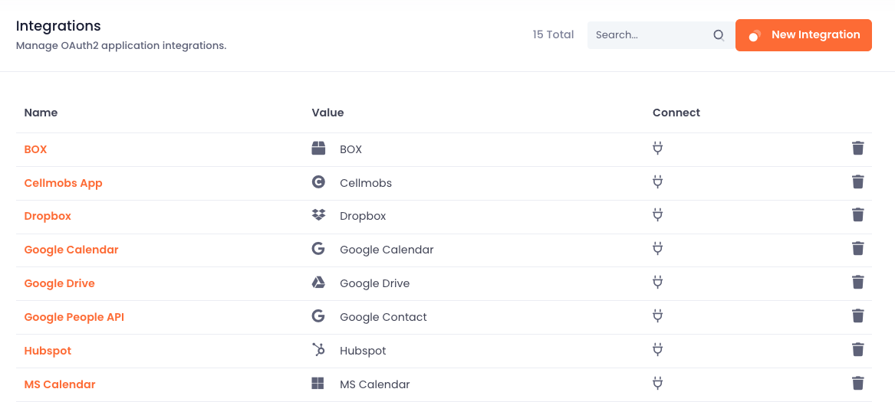
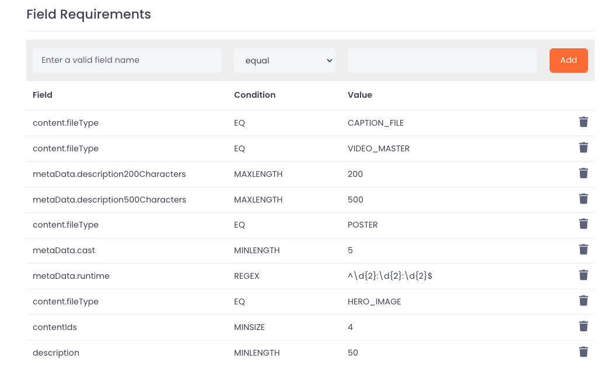

# Setting up Workflow

Cellmobs offers a variety of tools that can be customized to support different workflows, catering to the unique needs of businesses, marketing, and data management processes. The platform leverages hundreds of system and application events that are triggered under specific conditions, which can be chained together to create dynamic and adaptable workflows.

These events are tightly coupled with the core entities, such as Products, Organizations, Orders, Deals, and more. By utilizing different `ProcessType` values (e.g.,`SAVE`, `DELETE`, `MOVE`, `SYNC`) and `EntityStatus` values (e.g., `PENDING`, `APPROVED`), developers have the flexibility to execute various tasks based on the specific event conditions.

For example, developers can choose to:

- **Update another Entity locally**: When certain events occur, a local task can be executed to update related entities within the application. This allows for seamless data synchronization and ensures that the information remains accurate and up-to-date.

- **Send data to external APIs**: Developers can also configure events to interact with external APIs, such as Hubspot for CRM or Dropbox for file storage. This enables seamless integration with third-party tools and services, expanding the capabilities of the Cellmobs platform and enhancing the overall functionality of the application.

By offering customizable tools and the ability to create tailored workflows, Cellmobs empowers developers to design and implement efficient, automated processes that adapt to the specific requirements of their applications. This flexibility not only streamlines operations but also drives innovation and enables businesses to optimize their use of the Cellmobs platform.

## Integrations

Cellmobs recognizes the importance of seamless API integrations in today's interconnected world, and as such, it supports numerous API integrations that enable developers to connect their applications with popular cloud apps. This allows for the expansion of application capabilities, easier data synchronization, and overall enhanced functionality.

<figure markdown>
{loading=lazy}
    <figcaption>Sample List of Integrations</figcaption>
</figure>

Furthermore, Cellmobs supports Zapier, a well-known platform that connects various apps and services through automated workflows. This integration enables developers to create custom, automated processes between Cellmobs and other platforms without the need for extensive coding or development work. 

In addition to these integrations, Cellmobs is currently working on a plugin framework designed to empower developers to register their own integrations with the platform. This feature will allow developers to create custom integrations tailored to their specific needs or even publish them for the broader Cellmobs development community. 

By offering a wide range of API integrations, support for Zapier, and an upcoming plugin framework, Cellmobs ensures that developers have the tools and flexibility necessary to create robust, interconnected applications that can easily adapt to the evolving needs of their users and businesses.

Click here to learn how to [configure Integrations](/app-console/manage-integrations).

## API Processes
Before we get started

<figure markdown>
{loading=lazy}
    <figcaption>Sample API Processes List</figcaption>
</figure>

Click here to learn how to [configure API processes](/app-console/manage-workflow).

## Requirements

Entity Requirements not only help ensure [data consistency](/setup/model-schema) and integrity by enforcing specific conditions and constraints on entity attributes, they also can be used to trigger certain events that will kick off certain configured workflows and API processes.  

For instance, when an entity requirement validation fails and the `EntityStatus` changes, it can trigger a predefined event, such as sending an email or text message to a designated person who needs to be notified of the failure. This ensures that issues are promptly addressed and resolved, maintaining the overall stability and reliability of the application.

By leveraging Entity Requirements in this manner, developers can create custom, event-driven workflows that respond to changes in the data model. This provides a more robust and dynamic system that can adapt to various situations, streamline processes, and improve overall efficiency.

<figure markdown>
{loading=lazy}
    <figcaption>Entity Requirements Example</figcaption>
</figure>

Click here to learn how to [configure entity requirements](/app-console/manage-workflow).

  