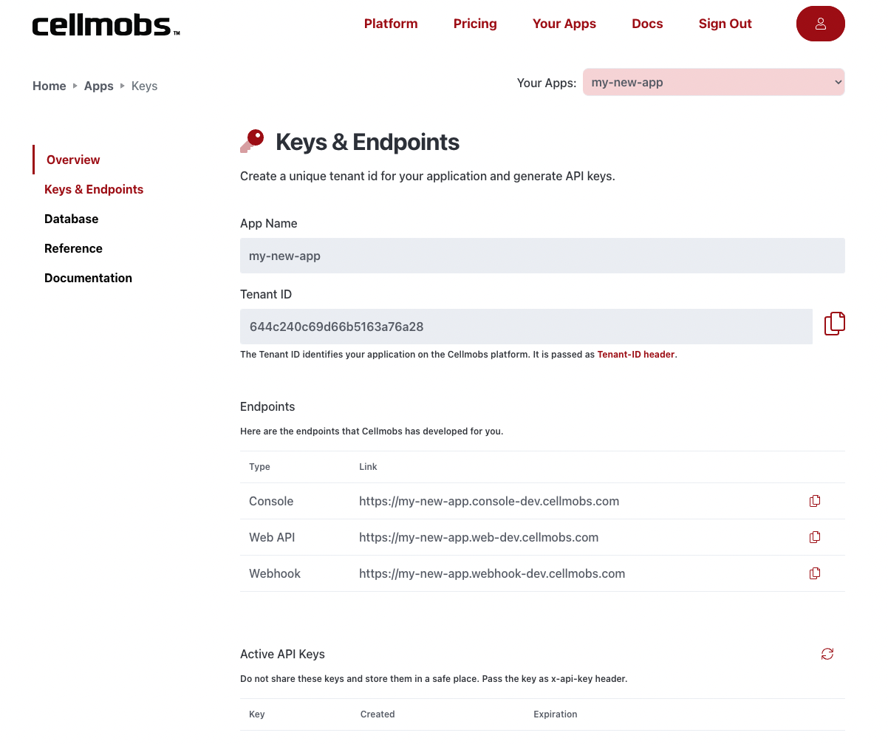
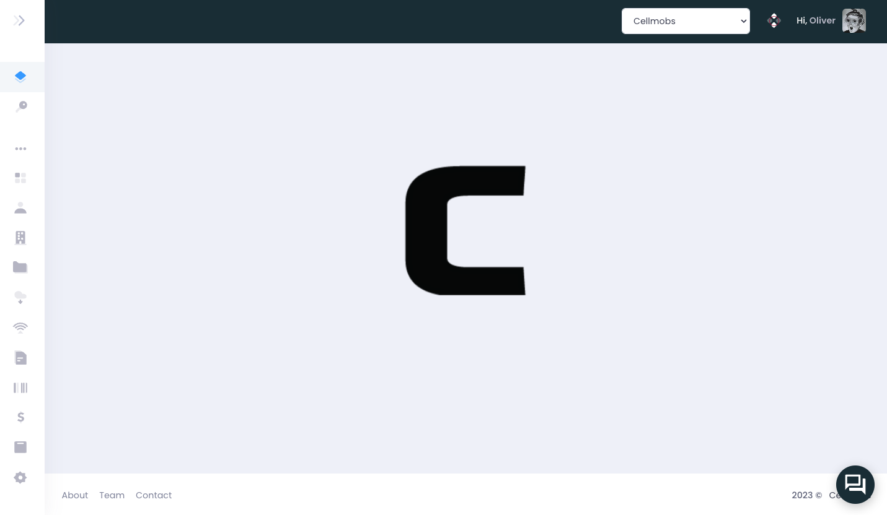

# Setup and Management

The are two main parts to creating, configuring, and managing your Cellmobs apps, the **Your Apps** section on the main [[Cellmobs website](https://www.cellmobs.com/apps{target="_blank"}, and dedicated App Console sites that are created for each of the apps you provision.

## Your Apps 
The [Your Apps](https://www.cellmobs.com/apps{:target="_blank"}) section in the Cellmobs websiote provides users with a centralized location to manage the main aspects of their apps, such as creating new apps, generating new API keys, monitoring app activity and usage, and reviewing billing statements. 

<figure markdown>
{width="100%" loading=lazy}
    <figcaption>App Endpoints and Keys</figcaption>
</figure>

Some of the key functionalities of the "Your Apps" section include:

- **App Management** allows you to provision, view and manage all your Cellmobs apps in one place. 
- **App Overview** provides you with detailed insights into your app's performance, including metrics such as the number of requests, storage usage (both database and file), the number of apps, team members, and more. By monitoring these metrics, you can make informed decisions about scaling your app, optimizing performance, and allocating resources effectively. 
- **API Key Management** enables you to generate new API keys for your applications and rotate old ones, ensuring that your app remains secure and up-to-date. This is crucial for maintaining the security and integrity of your applications and protecting sensitive data.
- **Billing Statements** offers a detailed overview of your billing statements, allowing you to track your app's expenses and ensure that you're staying within budget. You can review detailed breakdowns of your costs, identify areas for potential savings, and manage your billing preferences.

## App Console
Each Cellmobs App is configured and managed through a [Cellmobs App Console :fontawesome-solid-table-columns:](/app-console/getting-started), a powerful and user-friendly interface that provides you with all the tools necessary to manage every aspect of your application. The console, accessible via a dedicated url that is configured whenever you create a new Cellmobs App in the cellmobs.com website (e.g. myapp.console.cellmobs.com ). 

<figure markdown>
{width="100%" loading=lazy}
    <figcaption>Dedicated App Consoles</figcaption>
</figure>

By using the Cellmobs App Console, you can efficiently configure and manage all aspects of your application, ensuring a seamless and user-friendly experience. The console provides a centralized location for managing your app's resources, settings, and content, simplifying the app management process and allowing you to focus on delivering a top-notch experience for your users.

  

