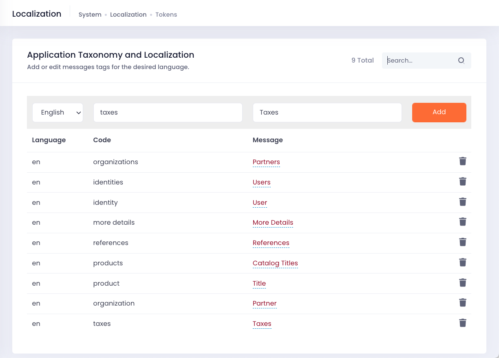

# Taxonomy & Localization

Taxonomies and labeling play a crucial role in making an application transparent, consistent, and understandable. They are vital components of the information architecture that underpin the success of any application. Taxonomies help organize, classify, and categorize information, making it easier for users to navigate and find the content they need. Labeling, on the other hand, ensures that the terminology used in the application is consistent and easily understood by users.

Cellmobs recognizes the importance of taxonomies and labeling and has built-in support for localization, tag hierarchies, and a wide range of vocabularies. This enables users to define labels, categories, and classifications that are tailored to their specific use cases and business verticals. By offering a flexible and comprehensive approach to taxonomies and labeling, Cellmobs ensures that applications built on its platform can cater to diverse audiences and adapt to various business requirements.

Some of the key benefits of using taxonomies and labeling in your application include:

- **Improved User Experience**: By organizing information in a consistent and logical manner, taxonomies and labeling help users quickly find and access the content they need, leading to a better overall user experience.
- **Enhanced Navigation**: Taxonomies and labeling make it easier for users to search and discover content within the application, as they provide a clear structure and classification system that simplifies the search process and navigation.
- **Consistent Terminology**: Labeling ensures that the application uses consistent terminology across all its components, which helps users understand and interact with the system more effectively.
- **Localization**: Cellmobs' support for localization allows applications to cater to users in different regions and languages, ensuring a more inclusive and accessible experience.
- **Customization**: With a large number of vocabularies and the ability to define custom labels and categories, Cellmobs allows users to create taxonomies and labeling systems that match their unique business needs and requirements.

## Vocabularies

<figure markdown>
{loading=lazy}
    <figcaption>Vocabularies</figcaption>
</figure>

Click here to learn how to [configure vocabularies](/app-console/manage-vocabularies).

## Localization

<figure markdown>
{loading=lazy}
    <figcaption>Taxonomy &amp; Localization</figcaption>
</figure>

Click here to learn how to [configure taxnonomies](/app-console/manage-taxonomy).

## Tags & Types

Cellmobs Tags are a versatile and powerful feature that can be utilized in various ways to enhance the organization and functionality of your app. 

Click here to learn how to [configure tags](/setup/setting-up-tags).

  